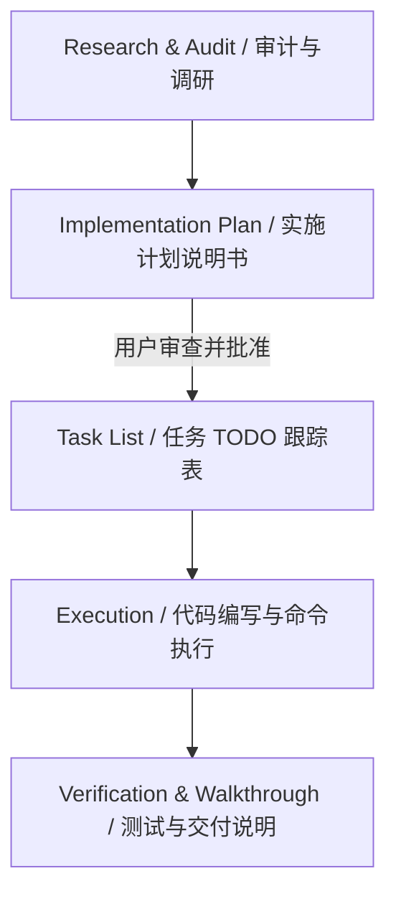
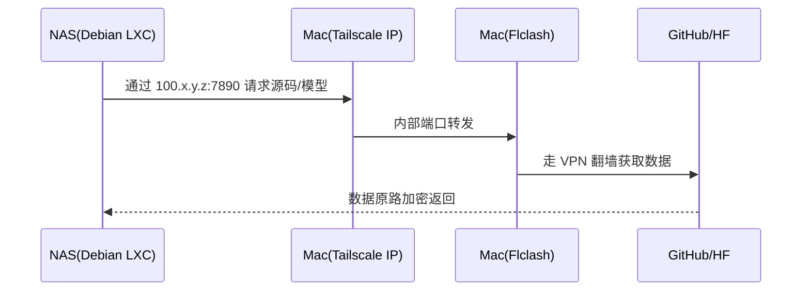

# 高级AI协同开发工程化手册 (AI Stepped Automation Playbook & Engineering Manual)

---

## 前言：核心设计哲学 (Core Design Philosophy)

在软件工程进入 AI 辅助时代后，传统的“单次提示词-单次输出”模式正逐渐被**智能体工作流 (Agentic Workflows)** 取代。本手册的核心哲学在于：**“声明式规划，渐进式执行，自动化验证”**。

1. **智能体（Agent）不只是聊天窗口**：AI Agent 是一个拥有工具（File Read/Write, Terminal Command, Web Search）的自治回路，应像对待一个初级工程师一样，赋予其清晰的上下文约束和验证机制。
2. **人类主导规划 (Human-in-the-loop)**：在架构设计、数据库变更等高风险决策上，人类必须通过“实施计划 (Implementation Plan)”进行把关，坚决杜绝 AI 进行猜测性的盲目代码修改。
3. **沙箱与安全边界**：所有的命令执行应默认在沙箱中运行，访问外部网络或宿主机资源时，通过专用的安全通道（如本手册新增的 Tailscale 加密隧道）进行。

---

## 第一章：动态工作流 (Dynamic Workflows) 通用模板

在执行复杂的重构或新功能开发时，Antigravity 遵循四阶段标准工作流：



### 1.1 调研阶段 (Research)
- 不修改任何源码，只读方式检索 AST、符号定义和现有配置文件。
- 检索相关依赖库的最佳实践文档。

### 1.2 计划阶段 (Planning)
- 生成 `implementation_plan.md`，明确指明：
  - **修改范围**：用 `[MODIFY]`, `[NEW]`, `[DELETE]` 标明文件。
  - **核心逻辑变更**：伪代码或核心代码差异（Diff）。
  - **验证手段**：自动化测试命令和手动验证场景。

### 1.3 执行阶段 (Execution)
- 创建 `task.md`，使用标准 TODO 语法跟踪状态：
  - `[ ]` 未开始，`[/]` 进行中，`[x]` 已完成。
  - 严禁并行修改多个不相关模块。

### 1.4 验证阶段 (Verification)
- 运行测试套件（如 `cargo test` 或 `pytest`），并附带测试结果日志。
- 生成 `walkthrough.md` 交付报告。

---

## 第二章：模块化规则矩阵 (Modular Glob Rules) 架构方案

为了让 AI 遵守特定的工程规范，我们使用规则文件限制其决策空间。

### 2.1 核心业务逻辑与架构约束 (`.agents/rules/core.md`)
- **语言标准**：Rust 必须使用 `2021 edition`，避免不安全的 `unsafe` 代码；Python 必须指定类型标注（Type Hints）。
- **异步处理规范**：异步代码优先使用 `tokio` 运行时，禁止阻塞调用（如在异步上下文中使用阻塞的 `std::fs` 或网络请求）。
- **注释与文档**：修改代码时必须保留原有的 docstring。所有新增的公共 API 必须编写文档注释。

### 2.2 数据与存储密集型约束 (`.agents/rules/storage.md`)
- **Unix Domain Socket 访问限制**：容器间的通信（如本地 Podman Socket `/run/podman/podman.sock`）必须通过异步的 `UnixStream` 建立，且必须处理连接被拒（Connection Refused）的重试逻辑。
- **配置防泄漏**：凡是包含 Token、API Key 的配置文件（如 `config.toml`），必须确保其文件权限为 `600` (`chmod 600`)，AI 在读取此类文件时必须校验权限。

### 2.3 自动化测试与交付约束 (`.agents/rules/tests.md`)
- **测试隔离**：单元测试严禁依赖外部真实网络和运行中的容器服务，必须使用 Mock 实现。
- **编译守卫**：在提交修改之前，AI 必须在沙箱中运行 `cargo check` 或 `npm run build` 验证没有语法和编译错误。

---

## 第三章：事前尸检与对抗性审查 (Pre-Mortem Loop) 元提示词

“事前尸检”是指在系统上线或代码写入之前，假定系统已经彻底崩溃，并推导崩溃的原因，从而提前修改设计。

### 3.1 对抗性审查元提示词 (Meta-Prompt)

> [!IMPORTANT]
> 将以下元提示词发送给 AI，使其在编写核心方案前自我审查：

```text
你现在扮演一位资深的对抗性系统架构师。在针对当前任务 [插入任务描述] 编写实现代码之前，请先执行“事前尸检（Pre-Mortem）”分析：
1. 假设当前代码已经上线，但由于未处理的边界条件、网络延时、权限问题或配置错误导致了严重的线上故障。
2. 请列出 3 个最可能导致系统崩溃或逻辑失效的潜在“死因”（如：DDNS提供商API速率限制导致进程被挂起、本地 Socket 文件路径无读写权限等）。
3. 针对每一个“死因”，提出具体的、防御性的代码改进方案。
4. 请在 implementation_plan.md 的 "User Review Required" 章节中呈现这一分析。
```

---

## 第四章：本地自动化管道流 (Python API Pipeline) 核心脚本

以下是一个用于在本地协调 Git 状态、执行测试和验证配置文件的自动化管道脚本：

```python
#!/usr/bin/env python3
# -*- coding: utf-8 -*-
"""
AI 协同开发管道管理脚本 (pipeline.py)
用于规范 AI Agent 在本地修改代码后的自动化校验流程。
"""
import os
import sys
import subprocess
import tomllib  # Requires Python 3.11+

def run_command(cmd, cwd=None):
    """安全执行终端命令并返回输出"""
    try:
        result = subprocess.run(
            cmd, cwd=cwd, shell=True, check=True,
            stdout=subprocess.PIPE, stderr=subprocess.PIPE, text=True
        )
        return True, result.stdout
    except subprocess.CalledProcessError as e:
        return False, f"Command failed: {e.stderr}\nOutput: {e.stdout}"

def verify_configs():
    """安全检查：确保本地配置文件没有泄露风险且格式正确"""
    config_path = "/etc/nas-gatekeeper/config.toml"
    if not os.path.exists(config_path):
        # 兼容本地开发测试路径
        config_path = "config.toml"
        if not os.path.exists(config_path):
            print("[WARN] 配置文件不存在，跳过权限校验。")
            return True

    # 1. 检查权限 (必须为 600)
    stat_info = os.stat(config_path)
    mode = stat_info.st_mode & 0o777
    if mode != 0o600:
        print(f"[ERROR] 安全隐患：{config_path} 的权限为 {oct(mode)}，非 0o600！")
        return False

    # 2. 检查 TOML 格式
    try:
        with open(config_path, "rb") as f:
            tomllib.load(f)
        print("[PASS] 配置文件格式与权限校验通过。")
        return True
    except Exception as e:
        print(f"[ERROR] 配置文件解析失败: {e}")
        return False

def run_tests():
    """运行项目自动化测试"""
    print("开始运行自动化测试套件...")
    # 判断项目类型执行相应测试
    if os.path.exists("Cargo.toml"):
        success, output = run_command("cargo test")
    elif os.path.exists("package.json"):
        success, output = run_command("npm test")
    else:
        print("[INFO] 未检测到标准的 Cargo/NPM 项目，跳过单元测试。")
        return True

    if not success:
        print(f"[FAIL] 测试失败！详细信息:\n{output}")
        return False
    print("[PASS] 所有自动化单元测试均通过。")
    return True

def main():
    print("=== 开始执行本地自动化验证管道 ===")
    
    # 步骤 1: 配置文件安全审计
    if not verify_configs():
        sys.exit(1)
        
    # 步骤 2: 编译与测试校验
    if not run_tests():
        sys.exit(2)
        
    print("=== [SUCCESS] 本地管道所有安全及功能校验已完美通过！ ===")

if __name__ == "__main__":
    main()
```

---

## 第五章：专为您定制：NAS 部署与远程 AI 推理同步 (Tailscale & PVE)

针对您的 **Intel N100 处理器 (PVE 9.2) + Debian 13 LXC 容器**，本章提供完整的异地 AI 托管与代理同步规范。

### 5.1 在 N100 上部署具有 AVX2 优化的推理引擎

Intel N100 (Alder Lake) 不支持 AVX-512，但**原生支持 AVX2 和 FMA**。我们将使用自定义的 `llama.cpp` 分支编译以提供最快的 CPU 推理速度。

1. **拉取定制 llama.cpp 源码**：
   ```bash
   git clone https://github.com/PrismML-Eng/llama.cpp.git
   cd llama.cpp
   ```
2. **启用 AVX2 加速编译**：
   ```bash
   cmake -B build -DGGML_AVX2=ON -DGGML_AVX=ON
   cmake --build build --config Release -j$(nproc)
   ```
3. **在 LXC 内以后台守护进程方式运行服务**：
   运行以下命令，设置强 API Key 鉴权防范外网扫描：
   ```bash
   nohup ./build/bin/llama-server \
     -m ./models/Ternary-Bonsai-8B-Q2_0.gguf \
     --host 0.0.0.0 \
     --port 8080 \
     --api-key "my_secret_bonsai_key" > llama.log 2>&1 &
   ```

### 5.2 Tailscale 跨局域网代理共享与本地 Nvim 同步

由于小主机处于异地局域网，且国内拉取 GitHub 慢，我们将通过 Tailscale 安全通道让小主机借用 Mac 的网络：



1. **小主机环境变量配置**：
   在异地小主机的 Debian 容器内导入临时代理：
   ```bash
   export http_proxy="http://<Mac_Tailscale_IP>:7890"
   export https_proxy="http://<Mac_Tailscale_IP>:7890"
   ```
2. **配置 macOS Nvim 连接到远程 NAS 进行推理**：
   修改您 Mac 的 Nvim `ai.lua` 配置文件，使 `bonsai` 适配器通过 Tailscale 安全访问异地小主机的 API 端口：
   ```lua
   bonsai = function()
     return require("codecompanion.adapters").extend("openai_compatible", {
       name = "bonsai",
       env = {
         url = "http://<NAS_LXC_Tailscale_IP>:8080", -- 指向 N100 小主机的 Tailscale IP
         api_key = "my_secret_bonsai_key",         -- 设置对应的鉴权密钥
       },
       schema = {
         model = { default = "prism-ml/Ternary-Bonsai-8B-mlx-2bit" },
       },
       opts = { curl_timeout = 25 },               -- 针对异地网络适当加长超时
     })
   end,
   ```

---

## 避坑指南：如何避免在手机端查看时出现乱码

PDF 文件出现乱码通常是由于**没有将中文字体数据嵌入 PDF 文件中**，导致手机操作系统（尤其是非苹果系统，如 Android）找不到系统级“苹方（PingFang）”字体而无法渲染。

**本手册建议的阅读与分发方案**：
1. **优先使用 Markdown 阅读（推荐）**：将本文档直接以 `.md` 格式保存在您手机上的 Obsidian 或其他 Markdown 浏览器中。由于 Markdown 是纯文本，会直接调用您手机当前的默认字体进行渲染，**100% 不会出现任何乱码**。
2. **在浏览器中“打印为 PDF”**：如果您必须使用 PDF 格式，可以先用 Mac 浏览器（如 Safari 或 Chrome）打开本文档对应的 HTML 页面，在打印菜单中选择 **“另存为 PDF” (Save as PDF)**。现代浏览器在生成 PDF 时会**强制将所用字体渲染为矢量字型或内嵌至 PDF 中**，生成的 PDF 在任何手机上都不会再显示乱码。
