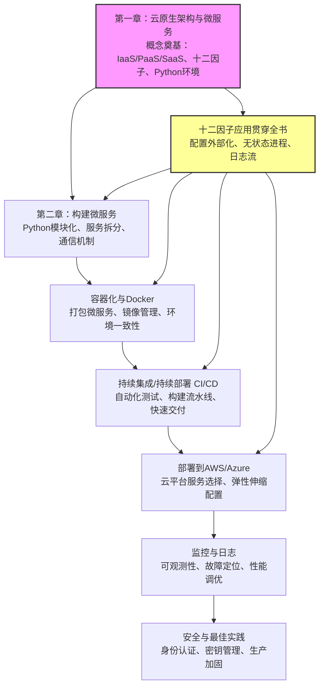

# 📚 《Cloud Native Python Build and deploy resilent applications on the cloud using microservices, AWS, Azure and more (Manish Sethi) (Z-Library)》极客精读缩减本与研习研学

> [!INFO] 书籍元数据
> - **原著总字数**: `391,908 字`
> - **干货缩减本**: `5,066 字` (压缩率: `1.3%`)
> - **双引擎算力**: `Doubao-Evolving (结构去水) + DeepSeek-V4-Pro (深度题解)`
> - **生成时间**: `2026-08-22 12:01:37`

---

## 🎧 双人对谈听书音频 (Audio Overview)
> 💡 *本期双人播客对谈由火山方舟大模型重构编剧，通勤散步随时听懂整本书！*
> *(音频合成中 / 点击可播放配套音频)*

---

## 🔍 第一部分：3分钟极简透视与知识脉络
## 1. 一句话主旨

> **以 Python 为利刃，将十二因子应用与微服务架构注入云原生血脉，让开发者从裸机时代跃迁至可弹性伸缩的云端工程实践。**

---

## 2. 5 大颠覆性洞见 (Key Takeaways)

1. **云原生是对部署范式的降维打击**  
   从 2000 年亲自去数据中心安装服务器，到如今通过 IaaS/PaaS/SaaS 抽象基础设施，开发者只需关注代码本身——基础设施变成了可编程、可调用的资源，而非物理负担。

2. **微服务并非全新发明，而是旧思想的云化重组**  
   微服务不是凭空出现的概念，它是对模块化、SOA 等既有架构思想的重新组合与落地。其真正颠覆之处在于**独立部署、独立伸缩**的工程能力，而非服务拆分的表面形式。

3. **Python 的“可读性”本身就是一种架构优势**  
   在微服务协作中，代码即文档。Python 的高可读性降低了团队沟通成本，加速迭代；加上丰富的库生态、交互模式和天然的可扩展性，使其成为云原生微服务开发的理想语言——**不是因为流行，而是因为工程适配**。

4. **十二因子应用将“非功能需求”提升为架构一等公民**  
   配置、日志、依赖管理、端口绑定等看似琐碎的细节，在云原生环境中决定了应用能否弹性伸缩、快速部署。十二因子不是检查清单，而是**云原生应用的宪法**——应用必须“为云而生”，而非“迁移上云”。

5. **云原生开发者必须成为全栈工程师**  
   CI/CD、Docker、云平台 API 不再是运维团队的专利，而是开发者日常武器。前言明确指出：全栈开发者、云基础知识和小型团队高效产出是当今常态，**工具链的掌握速度决定团队竞争力**。

---

## 3. 全书逻辑架构 (Mermaid 脉络图)

> 基于已提供文本（前言、目录开头）及书名推断，全书逻辑脉络如下：



**脉络解读**：  
- **第一章**奠定理论基础：从云计算演进到云原生概念，强调十二因子与 Python 环境准备。  
- **第二章**进入实践：用 Python 构建微服务，解决模块化与通信问题。  
- **后续章节**（推断）沿“容器化 → 自动化交付 → 多云部署 → 可观测性 → 安全加固”的工程链路递进，形成从代码到生产的完整闭环。  
- **十二因子**作为横切关注点，贯穿所有环节，确保应用天然具备云原生弹性。

---

## 📖 第二部分：20%~25% 精华干货缩减本 (去水留精)
# Cloud Native Python 精华缩减本

> **原书信息**：Manish Sethi 著，Packt Publishing，2017年
> **重构原则**：剔除出版冗余与过时铺垫，保留核心概念、架构逻辑与实战要点


## 📌 【核心概念与理论体系】

### 1. 云计算服务模型三层架构

| 模型 | 控制权 | 典型场景 |
|------|--------|----------|
| **IaaS**（基础设施即服务） | 用户管理 OS、运行时、应用 | 需要精细控制底层资源 |
| **PaaS**（平台即服务） | 用户只管应用与数据 | 快速部署，不关心基础设施 |
| **SaaS**（软件即服务） | 供应商全权管理 | 终端用户直接使用 |

**核心决策逻辑**：选择哪一层取决于团队对底层控制的诉求与运维成本的权衡。云原生应用通常构建在 PaaS 或容器化 IaaS 之上。

### 2. 云原生（Cloud Native）的本质定义

云原生不是单一技术，而是一组**构建和运行可弹性扩展应用的方法论**：

- **云原生运行时**：容器（Docker）、编排（Kubernetes）、Serverless（AWS Lambda / Azure Functions）
- **云原生架构**：微服务拆分、API 驱动、声明式基础设施、自动化交付流水线
- **核心目标**：让应用**动态伸缩**以应对任意规模的数据量、流量或用户数

### 3. 微服务 vs 单体架构

微服务并非全新概念，而是对 SOA（面向服务架构）的现代化演进。其核心特征：

- 每个服务**独立部署、独立扩展、独立数据存储**
- 服务间通过**轻量级协议**（HTTP/REST、消息队列）通信
- 团队可以**独立开发与发布**，降低耦合

### 4. 十二要素应用（The Twelve-Factor App）

云原生应用的**黄金准则**，核心要素：

| 要素 | 核心要求 |
|------|----------|
| **代码库** | 一份代码库，多次部署 |
| **依赖** | 显式声明依赖，不依赖系统隐式包 |
| **配置** | 配置与代码严格分离（环境变量注入） |
| **后端服务** | 将数据库、缓存等视为可替换资源 |
| **构建/发布/运行** | 严格分离三个阶段 |
| **进程** | 无状态进程，状态外置 |
| **端口绑定** | 通过端口暴露服务，自我包含 |
| **并发** | 通过进程模型横向扩展 |
| **易处理** | 快速启动、优雅停机 |
| **环境等价** | 开发/预发/生产环境尽可能一致 |
| **日志** | 日志作为事件流输出到 stdout |
| **管理进程** | 管理任务作为一次性进程运行 |

### 5. 为什么 Python 是云原生微服务的优选语言

- **可读性**：语法简洁，降低团队协作与代码审查成本
- **生态与社区**：Flask、Django、FastAPI、Celery、Boto3 等成熟库覆盖微服务全链路
- **交互模式**：REPL 便于快速原型验证与调试
- **可扩展性**：通过多进程/异步模型（asyncio）支撑高并发场景


## ⚙️ 【底层原理解构与关键实现】

### 1. 云原生应用的运行时选择逻辑

```
┌─────────────────────────────────────────────┐
│           应用层（Python 微服务）              │
├─────────────────────────────────────────────┤
│  容器运行时（Docker）  │  Serverless（FaaS）   │
├─────────────────────────────────────────────┤
│  编排层（Kubernetes）  │  平台托管（AWS/Azure） │
├─────────────────────────────────────────────┤
│         IaaS（虚拟机 / 裸金属）                │
└─────────────────────────────────────────────┘
```

**决策原则**：
- 需要**长期运行、复杂依赖、精细资源控制** → Docker + Kubernetes
- 需要**事件驱动、突发流量、零运维** → Serverless
- 团队规模小、追求**快速交付** → PaaS（如 Heroku、Elastic Beanstalk）

### 2. Python 环境搭建关键路径

#### Linux（Debian/Ubuntu）

```bash
# 方式一：APT 包管理（快速但版本可能滞后）
sudo apt-get update
sudo apt-get install python3 python3-pip

# 方式二：源码编译（获取最新版本，完全控制）
# 下载源码 → ./configure → make → make install
```

#### Windows

```powershell
# 推荐使用 Chocolatey 包管理器
choco install python git -y
```

#### macOS

```bash
# 先安装 Xcode 命令行工具
xcode-select --install

# 使用 Homebrew 安装 Python
brew install python
```

### 3. Git 版本控制基础

```bash
# 初始化仓库
git init

# 克隆远程仓库
git clone <repository-url>

# 查看状态与提交
git status
git add .
git commit -m "commit message"

# 推送与拉取
git push origin main
git pull origin main
```

**云原生实践要点**：Git 不仅是代码版本控制，更是 CI/CD 流水线的**触发源头**——每次 push 都应自动触发构建、测试与部署。


## 💡 【经典案例剖析与反向避坑】

### 案例：从传统部署到云原生的演进路径

**传统方式（2000年代）**：
- 开发者需亲自到 ISP 数据中心安装物理机器 + RAID 配置
- 部署周期以天/周计，扩容需采购硬件

**虚拟化时代（2003-2006）**：
- 共享主机 + 虚拟机，部署效率提升但仍需手动管理

**云原生时代（现在）**：
- AWS/Azure/GCP + Python + Docker，**分钟级**启动与弹性伸缩
- 核心转变：从"管理机器"到"管理服务"

### 反向避坑清单

| 陷阱 | 后果 | 正确做法 |
|------|------|----------|
| 将配置硬编码在代码中 | 环境切换时需改代码重新部署 | 使用环境变量注入配置 |
| 单体应用强行拆分为微服务 | 分布式复杂度爆炸，运维成本飙升 | 先模块化，再按业务边界逐步拆分 |
| 忽略日志标准化 | 排障时无法关联分布式调用链 | 统一输出 JSON 格式日志到 stdout |
| 开发/生产环境不一致 | "本地能跑，线上崩溃" | 使用 Docker 统一环境 |
| 忽视优雅停机 | 请求中断、数据不一致 | 实现 SIGTERM 处理与健康检查 |


## 🛠️ 【实战落地 Checklist 与行动指南】

### 云原生 Python 微服务启动清单

- [ ] **环境准备**
  - [ ] 安装 Python 3.x（推荐 3.8+）
  - [ ] 安装 Git 并配置 SSH 密钥
  - [ ] 安装 Docker Desktop（本地容器环境）
  - [ ] 配置虚拟环境工具（venv / poetry / pipenv）

- [ ] **项目结构初始化**
  - [ ] 创建独立代码仓库（GitHub/GitLab）
  - [ ] 编写 `requirements.txt` 或 `pyproject.toml` 显式声明依赖
  - [ ] 配置 `.gitignore` 排除敏感文件与构建产物
  - [ ] 创建 `Dockerfile` 定义应用运行环境

- [ ] **十二要素合规检查**
  - [ ] 配置通过环境变量读取（如 `os.environ.get("DATABASE_URL")`）
  - [ ] 日志输出到 stdout（使用 `logging` 模块配置 StreamHandler）
  - [ ] 服务通过端口绑定（Flask/FastAPI 监听 `0.0.0.0:$PORT`）
  - [ ] 无状态设计：Session 存入 Redis，文件存入对象存储

- [ ] **微服务拆分原则**
  - [ ] 按业务域（Domain）划分服务边界
  - [ ] 每个服务拥有独立数据库/数据模型
  - [ ] 服务间通信优先 REST API，异步场景引入消息队列
  - [ ] 为每个服务编写独立的健康检查端点（`/health`）

- [ ] **CI/CD 流水线**
  - [ ] 配置 Git 触发自动构建（GitHub Actions / Jenkins）
  - [ ] 构建阶段：安装依赖 → 运行单元测试 → 构建 Docker 镜像
  - [ ] 部署阶段：推送镜像到 Registry → 更新容器编排配置
  - [ ] 配置回滚策略与灰度发布

- [ ] **可观测性**
  - [ ] 集成结构化日志（JSON 格式）
  - [ ] 配置指标监控（Prometheus + Grafana）
  - [ ] 实现分布式追踪（OpenTelemetry）

### 快速启动模板

```python
# app.py - 最小云原生 Python 微服务
import os
from flask import Flask, jsonify

app = Flask(__name__)

@app.route("/health")
def health():
    return jsonify({"status": "ok"})

@app.route("/")
def index():
    return jsonify({
        "service": "cloud-native-python",
        "version": os.environ.get("APP_VERSION", "1.0.0")
    })

if __name__ == "__main__":
    port = int(os.environ.get("PORT", 5000))
    app.run(host="0.0.0.0", port=port)
```

```dockerfile
# Dockerfile
FROM python:3.11-slim
WORKDIR /app
COPY requirements.txt .
RUN pip install --no-cache-dir -r requirements.txt
COPY . .
EXPOSE 5000
CMD ["python", "app.py"]
```

---

> **核心提炼总结**：云原生 Python 开发的核心不在于某个具体工具，而在于**十二要素的工程纪律 + 微服务的边界思维 + 自动化交付流水线**。掌握这三者，即可在任何云平台（AWS/Azure/GCP）上构建弹性、可维护的分布式系统。

---

## 🎯 第三部分：章节精选研习测试题库 (交互答题)
#### 📝 第 1 题 (单选题)：关于云计算服务模型三层架构，以下哪项描述是正确的？

- [ ] A. IaaS 用户只需管理应用和数据，无需关心操作系统
- [ ] B. PaaS 用户需要管理运行时和中间件
- [ ] C. SaaS 供应商全权管理，终端用户直接使用
- [ ] D. 云原生应用只能构建在 IaaS 之上

<details>
<summary><b>👉 点击查看【正确答案与深度解析】</b></summary>

> **✅ 正确答案**：`C`  
> **📍 原著出处**：`云计算服务模型三层架构`  
>
> **💡 深度解析**：
> A 错误：IaaS 用户需要管理操作系统、运行时和应用，而非只管理应用和数据。B 错误：PaaS 用户只管应用与数据，无需管理运行时和中间件。D 错误：云原生应用通常构建在 PaaS 或容器化 IaaS 之上，并非只能构建在 IaaS 之上。C 正确：SaaS 模式下供应商全权管理，终端用户直接使用。

</details>

---

#### 📝 第 2 题 (单选题)：根据十二要素应用准则，关于“配置”的正确做法是？

- [ ] A. 将配置硬编码在代码中，便于版本管理
- [ ] B. 将配置存储在环境变量中，与代码严格分离
- [ ] C. 将配置写入配置文件并提交到代码库
- [ ] D. 将配置保存在数据库中以实现动态更新

<details>
<summary><b>👉 点击查看【正确答案与深度解析】</b></summary>

> **✅ 正确答案**：`B`  
> **📍 原著出处**：`十二要素应用`  
>
> **💡 深度解析**：
> 十二要素应用要求配置与代码严格分离，推荐通过环境变量注入配置。A 硬编码配置是反模式，环境切换时需改代码重新部署。C 将配置文件提交到代码库可能泄露敏感信息，且不便于环境切换。D 数据库存储配置不是十二要素推荐做法，且可能引入额外依赖。B 正确。

</details>

---

#### 📝 第 3 题 (单选题)：关于微服务架构，以下哪项描述最符合书籍中的定义？

- [ ] A. 微服务是一种全新的架构，与SOA无关
- [ ] B. 微服务要求所有服务共享同一个数据库
- [ ] C. 微服务中每个服务独立部署、独立扩展、独立数据存储
- [ ] D. 微服务之间必须使用消息队列通信，不能使用HTTP

<details>
<summary><b>👉 点击查看【正确答案与深度解析】</b></summary>

> **✅ 正确答案**：`C`  
> **📍 原著出处**：`微服务 vs 单体架构`  
>
> **💡 深度解析**：
> A 错误：微服务是对 SOA 的现代化演进，并非全新概念。B 错误：微服务强调每个服务拥有独立数据存储，而非共享数据库。D 错误：服务间可通过 HTTP/REST 或消息队列等轻量级协议通信，并非必须使用消息队列。C 正确：独立部署、独立扩展、独立数据存储是微服务的核心特征。

</details>

---

#### 📝 第 4 题 (单选题)：某团队需要开发一个事件驱动、突发流量、且希望零运维的应用，根据书籍的运行时选择逻辑，最合适的是？

- [ ] A. Docker + Kubernetes
- [ ] B. 传统虚拟机部署
- [ ] C. Serverless（如AWS Lambda）
- [ ] D. 自行管理物理服务器

<details>
<summary><b>👉 点击查看【正确答案与深度解析】</b></summary>

> **✅ 正确答案**：`C`  
> **📍 原著出处**：`云原生应用的运行时选择逻辑`  
>
> **💡 深度解析**：
> 书籍指出：需要事件驱动、突发流量、零运维的场景最适合 Serverless。A 适合长期运行、复杂依赖、精细资源控制的场景，且需要管理 Kubernetes 集群，运维负担较重。B 和 D 不符合云原生理念，无法快速弹性伸缩。C 正确。

</details>

---

#### 📝 第 5 题 (单选题)：以下哪项不是Python成为云原生微服务优选语言的主要原因？

- [ ] A. 语法简洁，可读性高
- [ ] B. 拥有Flask、Django等成熟微服务生态
- [ ] C. Python是编译型语言，执行效率极高
- [ ] D. 支持asyncio异步模型，可支撑高并发

<details>
<summary><b>👉 点击查看【正确答案与深度解析】</b></summary>

> **✅ 正确答案**：`C`  
> **📍 原著出处**：`为什么 Python 是云原生微服务的优选语言`  
>
> **💡 深度解析**：
> Python 是解释型语言，执行效率并非极高，且这并非其成为云原生优选语言的主要原因。A、B、D 都是书籍中提到的 Python 优势：可读性高、生态丰富、支持异步模型。C 错误。

</details>

---

#### 📝 第 6 题 (多选题)：以下哪些属于十二要素应用的核心要素？（多选）

- [ ] A. 代码库：一份代码库，多次部署
- [ ] B. 依赖：显式声明依赖
- [ ] C. 配置：配置与代码严格分离
- [ ] D. 用户界面：必须使用Web界面

<details>
<summary><b>👉 点击查看【正确答案与深度解析】</b></summary>

> **✅ 正确答案**：`A,B,C`  
> **📍 原著出处**：`十二要素应用`  
>
> **💡 深度解析**：
> 十二要素应用包括代码库、依赖、配置、后端服务、构建/发布/运行、进程、端口绑定、并发、易处理、环境等价、日志、管理进程等。A、B、C 均属于核心要素。D 不是十二要素之一，用户界面形式并非十二要素约束的内容。

</details>

---

#### 📝 第 7 题 (多选题)：在云原生Python微服务启动清单中，哪些属于“十二要素合规检查”的内容？（多选）

- [ ] A. 配置通过环境变量读取
- [ ] B. 日志输出到stdout
- [ ] C. 服务通过端口绑定
- [ ] D. 使用Docker统一环境

<details>
<summary><b>👉 点击查看【正确答案与深度解析】</b></summary>

> **✅ 正确答案**：`A,B,C`  
> **📍 原著出处**：`实战落地 Checklist 与行动指南`  
>
> **💡 深度解析**：
> 书籍的“十二要素合规检查”清单包括：配置通过环境变量读取（对应配置要素）、日志输出到 stdout（对应日志要素）、服务通过端口绑定（对应端口绑定要素）、无状态设计（对应进程要素）。D 使用 Docker 统一环境属于环境一致性实践，但不属于十二要素合规检查的直接内容。因此 A、B、C 正确。

</details>

---

#### 📝 第 8 题 (多选题)：关于从传统部署到云原生的演进以及反向避坑，以下哪些说法是正确的？（多选）

- [ ] A. 云原生时代，部署周期从以天/周计缩短到分钟级
- [ ] B. 将单体应用强行拆分为微服务可以立即降低运维成本
- [ ] C. 开发/生产环境不一致可能导致“本地能跑，线上崩溃”
- [ ] D. 忽视优雅停机可能导致请求中断、数据不一致

<details>
<summary><b>👉 点击查看【正确答案与深度解析】</b></summary>

> **✅ 正确答案**：`A,C,D`  
> **📍 原著出处**：`经典案例剖析与反向避坑`  
>
> **💡 深度解析**：
> A 正确：书籍指出云原生时代可实现分钟级启动与弹性伸缩。B 错误：强行拆分微服务会增加分布式复杂度，运维成本飙升，这是反向避坑清单中的陷阱。C 正确：环境不一致是常见陷阱，会导致本地正常但线上崩溃。D 正确：忽视优雅停机可能导致请求中断、数据不一致。因此 A、C、D 正确。

</details>

---

#### 📝 第 9 题 (实战案例题)：某创业公司开发一个Python微服务，该服务在特定时间段（如促销活动）会经历突发流量高峰，平时流量较低。团队规模较小，希望尽可能减少运维负担。根据书籍的运行时选择逻辑，以下哪种方案最合适？

- [ ] A. 自行采购物理服务器，部署Docker和Kubernetes集群
- [ ] B. 使用AWS Lambda等Serverless平台，按需执行函数
- [ ] C. 使用传统虚拟机，手动部署应用并配置负载均衡
- [ ] D. 使用PaaS平台如Heroku，但需要自己管理底层容器

<details>
<summary><b>👉 点击查看【正确答案与深度解析】</b></summary>

> **✅ 正确答案**：`B`  
> **📍 原著出处**：`云原生应用的运行时选择逻辑`  
>
> **💡 深度解析**：
> 案例描述：突发流量、团队小、希望减少运维负担，符合 Serverless 的适用场景（事件驱动、突发流量、零运维）。A 需要管理 Kubernetes 集群，运维负担重，不适合小团队。C 传统虚拟机手动部署无法快速弹性伸缩，且运维成本高。D PaaS 虽然减少部分运维，但 Heroku 等平台仍需管理一定配置，且不如 Serverless 按需执行灵活。因此 B 最合适。

</details>

---

#### 📝 第 10 题 (实战案例题)：某公司现有大型单体Python应用，团队考虑迁移到微服务架构，但担心分布式系统的复杂性。根据书籍的微服务拆分原则和反向避坑清单，以下哪种做法最合理？

- [ ] A. 立即将整个单体应用拆分为几十个微服务，每个服务独立数据库
- [ ] B. 保持单体应用不变，但将所有功能模块化，暂不拆分
- [ ] C. 先按业务域逐步拆分，从核心模块开始，每个服务独立部署和数据存储
- [ ] D. 将单体应用整体迁移到Serverless平台，实现自动拆分

<details>
<summary><b>👉 点击查看【正确答案与深度解析】</b></summary>

> **✅ 正确答案**：`C`  
> **📍 原著出处**：`微服务拆分原则与反向避坑清单`  
>
> **💡 深度解析**：
> 书籍建议：先模块化，再按业务边界逐步拆分，避免强行拆分导致复杂度爆炸。A 强行拆分为几十个微服务是反模式，会带来分布式复杂度爆炸。B 只模块化不拆分，没有实现微服务目标，无法获得独立部署和扩展的好处。D Serverless 不能自动拆分单体应用，需要重构。C 符合逐步拆分原则，从核心模块开始，按业务域划分，每个服务独立部署和数据存储，是最合理的做法。

</details>

---


---

## 🧠 第四部分：核心概念记忆闪卡 (Anki / 艾宾浩斯)
**🃏 卡片 1 [cloud-computing]**
> **Q（问题）**: 云计算服务模型有哪三层？各自的控制权和典型场景是什么？  
> **A（答案）**: IaaS（基础设施即服务）：用户管理 OS、运行时、应用，典型场景是需要精细控制底层资源；PaaS（平台即服务）：用户只管应用与数据，典型场景是快速部署，不关心基础设施；SaaS（软件即服务）：供应商全权管理，终端用户直接使用。核心决策逻辑：选择哪一层取决于团队对底层控制的诉求与运维成本的权衡。

**🃏 卡片 2 [cloud-native]**
> **Q（问题）**: 云原生（Cloud Native）的本质定义是什么？  
> **A（答案）**: 云原生不是单一技术，而是一组构建和运行可弹性扩展应用的方法论：云原生运行时包括容器（Docker）、编排（Kubernetes）、Serverless（AWS Lambda / Azure Functions）；云原生架构包括微服务拆分、API 驱动、声明式基础设施、自动化交付流水线；核心目标是让应用动态伸缩以应对任意规模的数据量、流量或用户数。

**🃏 卡片 3 [microservices]**
> **Q（问题）**: 微服务架构的核心特征有哪些？  
> **A（答案）**: 每个服务独立部署、独立扩展、独立数据存储；服务间通过轻量级协议（HTTP/REST、消息队列）通信；团队可以独立开发与发布，降低耦合。微服务并非全新概念，而是对 SOA（面向服务架构）的现代化演进。

**🃏 卡片 4 [twelve-factor]**
> **Q（问题）**: 十二要素应用（The Twelve-Factor App）包含哪些核心要素？  
> **A（答案）**: 代码库（一份代码库，多次部署）、依赖（显式声明依赖）、配置（配置与代码严格分离）、后端服务（可替换资源）、构建/发布/运行（严格分离）、进程（无状态进程）、端口绑定（通过端口暴露服务）、并发（通过进程模型横向扩展）、易处理（快速启动、优雅停机）、环境等价（开发/预发/生产环境一致）、日志（日志作为事件流输出到 stdout）、管理进程（管理任务作为一次性进程运行）。

**🃏 卡片 5 [python]**
> **Q（问题）**: 为什么 Python 是云原生微服务的优选语言？  
> **A（答案）**: 可读性：语法简洁，降低团队协作与代码审查成本；生态与社区：Flask、Django、FastAPI、Celery、Boto3 等成熟库覆盖微服务全链路；交互模式：REPL 便于快速原型验证与调试；可扩展性：通过多进程/异步模型（asyncio）支撑高并发场景。

**🃏 卡片 6 [runtime]**
> **Q（问题）**: 如何选择云原生应用的运行时？  
> **A（答案）**: 需要长期运行、复杂依赖、精细资源控制 → Docker + Kubernetes；需要事件驱动、突发流量、零运维 → Serverless；团队规模小、追求快速交付 → PaaS（如 Heroku、Elastic Beanstalk）。

**🃏 卡片 7 [setup]**
> **Q（问题）**: 在不同操作系统上安装 Python 的推荐方式是什么？  
> **A（答案）**: Linux（Debian/Ubuntu）：APT 包管理（sudo apt-get install python3 python3-pip）或源码编译（./configure → make → make install）；Windows：推荐使用 Chocolatey 包管理器（choco install python git -y）；macOS：先安装 Xcode 命令行工具（xcode-select --install），再使用 Homebrew 安装（brew install python）。

**🃏 卡片 8 [git]**
> **Q（问题）**: Git 在云原生实践中的关键作用是什么？基础命令有哪些？  
> **A（答案）**: Git 不仅是代码版本控制，更是 CI/CD 流水线的触发源头——每次 push 都应自动触发构建、测试与部署。基础命令：git init（初始化仓库）、git clone <repository-url>（克隆远程仓库）、git status / git add . / git commit -m "commit message"（查看状态与提交）、git push origin main / git pull origin main（推送与拉取）。

**🃏 卡片 9 [evolution]**
> **Q（问题）**: 从传统部署到云原生的演进路径经历了哪些阶段？核心转变是什么？  
> **A（答案）**: 传统方式（2000年代）：开发者需亲自到 ISP 数据中心安装物理机器 + RAID 配置，部署周期以天/周计，扩容需采购硬件；虚拟化时代（2003-2006）：共享主机 + 虚拟机，部署效率提升但仍需手动管理；云原生时代（现在）：AWS/Azure/GCP + Python + Docker，分钟级启动与弹性伸缩。核心转变：从“管理机器”到“管理服务”。

**🃏 卡片 10 [pitfalls]**
> **Q（问题）**: 云原生开发中常见的陷阱有哪些？如何避免？  
> **A（答案）**: 将配置硬编码在代码中 → 使用环境变量注入配置；单体应用强行拆分为微服务 → 先模块化，再按业务边界逐步拆分；忽略日志标准化 → 统一输出 JSON 格式日志到 stdout；开发/生产环境不一致 → 使用 Docker 统一环境；忽视优雅停机 → 实现 SIGTERM 处理与健康检查。

**🃏 卡片 11 [checklist]**
> **Q（问题）**: 启动云原生 Python 微服务项目需要完成哪些关键步骤？  
> **A（答案）**: 环境准备：安装 Python 3.x、Git 并配置 SSH 密钥、Docker Desktop、虚拟环境工具（venv / poetry / pipenv）；项目结构初始化：创建独立代码仓库、编写 requirements.txt 或 pyproject.toml 显式声明依赖、配置 .gitignore、创建 Dockerfile；十二要素合规检查：配置通过环境变量读取、日志输出到 stdout、服务通过端口绑定、无状态设计；微服务拆分原则：按业务域划分服务边界、每个服务独立数据库、优先 REST API、编写健康检查端点；CI/CD 流水线：Git 触发自动构建、构建阶段安装依赖/运行测试/构建镜像、部署阶段推送镜像/更新编排配置、配置回滚策略；可观测性：结构化日志、Prometheus + Grafana 监控、OpenTelemetry 分布式追踪。

**🃏 卡片 12 [template]**
> **Q（问题）**: 一个最小云原生 Python 微服务应包含哪些关键元素？  
> **A（答案）**: Flask 应用监听 0.0.0.0:$PORT，提供 /health 健康检查端点返回 {"status": "ok"}，通过环境变量读取配置（如 os.environ.get("APP_VERSION", "1.0.0")），Dockerfile 基于 python:3.11-slim，设置 WORKDIR /app，安装依赖（pip install --no-cache-dir -r requirements.txt），复制代码，EXPOSE 5000，CMD ["python", "app.py"]。


---

## 🎙️ 第五部分：双人对谈听书播客完整剧本
[睿哥]：欢迎来到今天的节目，我是睿哥。今天咱们聊一个特别火的话题——云原生 Python。小林，你最近是不是也在琢磨这个？

[小林]：睿哥好！是啊，现在到处都在说云原生、微服务，感觉不聊这个都不好意思说自己是搞开发的。但我一直有个困惑：云原生是不是就是把应用搬到云上就行了？

[睿哥]：哈哈，很多人都有这个误解。云原生可不是简单的“上云”，它是一套构建和运行弹性应用的方法论。你想想，同样是跑在云上，一个传统的单体应用和一个云原生应用，差别就像住酒店和住自己装修的房子——酒店你只能按它的规矩来，自己装修的房子你可以随意改造、按需扩展。

[小林]：这个比喻有意思。那具体来说，云原生到底包括哪些东西？

[睿哥]：核心是三块：容器化（比如 Docker）、微服务架构、还有十二要素应用。容器解决“运行环境一致”的问题，微服务解决“模块解耦”的问题，十二要素解决“应用怎么设计才符合云原生”的问题。三者合起来，才能让应用动态伸缩，应对任意规模的流量。

[小林]：微服务我听说过，就是把一个大的应用拆成很多小服务，对吧？但我也听人说，微服务不是银弹，拆不好反而更麻烦。

[睿哥]：没错，微服务不是越微越好。它本质是 SOA 的现代化演进，核心是独立部署、独立扩展、独立数据存储。但如果你把单体应用强行拆成几十个服务，分布式复杂度会爆炸，运维成本飙升。所以拆分的依据是业务边界，而不是代码行数。

[小林]：那怎么判断什么时候该拆呢？

[睿哥]：一个简单的判断：如果某个模块的变更经常需要和其他模块一起发布，或者它的负载特性和其他模块明显不同（比如一个 CPU 密集，一个 IO 密集），那就可以考虑拆。否则，先模块化，再逐步拆分，别一上来就搞微服务。

[小林]：明白了，不能为了拆而拆。那 Python 在云原生里有什么优势？我总觉得 Python 性能不行，跑微服务会不会拖后腿？

[睿哥]：这是个经典误解。云原生场景下，瓶颈往往在网络 IO、数据库、第三方服务，而不是 Python 本身的计算速度。Python 的优势在于开发效率高、可读性强，团队协作成本低。而且它的生态非常全：Flask、FastAPI 做 Web 服务，Celery 做异步任务，Boto3 操作 AWS，几乎覆盖微服务全链路。再加上 asyncio 异步模型，高并发也不是问题。

[小林]：那十二要素又是什么？听起来像什么武功秘籍。

[睿哥]：哈哈，可以这么理解，十二要素就是云原生应用的“黄金准则”，一共十二条，但我觉得最关键的有几个：配置分离、无状态进程、日志输出到 stdout、端口绑定。比如配置分离，就是要求你把数据库地址、密钥这些配置和代码分开，通过环境变量注入。这样你从开发切到生产，不用改代码，只改环境变量。

[小林]：这个我踩过坑！以前把数据库密码硬编码在代码里，结果一提交到 GitHub 就泄露了，后来改密码改到怀疑人生。

[睿哥]：对，这就是典型反面教材。还有无状态进程，意思是你的应用进程本身不保存用户状态，Session 放 Redis，文件放对象存储。这样服务重启或者水平扩展时，才不会丢数据。日志输出到 stdout 也很重要，容器环境里，你没法像传统那样写日志文件，必须输出到标准输出，然后由平台统一收集。

[小林]：那实际开发中，还有哪些常见的坑？

[睿哥]：我列几个最要命的：第一，开发/生产环境不一致，“本地能跑，线上崩溃”，这个用 Docker 统一环境就能解决。第二，忽略优雅停机，服务收到 SIGTERM 信号时不处理，导致正在处理的请求中断、数据不一致。第三，不做健康检查，服务挂了负载均衡还在往它发流量。这些都是血泪教训。

[小林]：那能不能给个快速开始的例子？比如一个最小的云原生 Python 服务长什么样？

[睿哥]：很简单，一个 Flask 应用，暴露两个端点：`/health` 返回 `{"status": "ok"}`，`/` 返回服务名和版本号。版本号从环境变量 `APP_VERSION` 读，端口也从环境变量 `PORT` 读。然后写一个 Dockerfile，基于 `python:3.11-slim`，安装依赖，拷贝代码，暴露端口，启动命令是 `python app.py`。就这么简单，但已经符合十二要素的核心要求了。

[小林]：听起来确实不难，那是不是有了这些，就算云原生了？

[睿哥]：这只是起点。真正的云原生还需要 CI/CD 流水线、可观测性（日志、监控、追踪）、自动化部署。但核心思想就三句话：十二要素的工程纪律、微服务的边界思维、自动化交付流水线。掌握这三者，你在任何云平台都能构建弹性、可维护的分布式系统。

[小林]：今天收获很大，睿哥最后给听众一句建议吧。

[睿哥]：别被“云原生”这个词吓到，它不是什么神秘技术，而是一套工程实践。从一个小服务开始，把配置分离、无状态、健康检查这些做好，你就已经走在云原生的路上了。动手试试，比看一百篇文章都强。

[小林]：谢谢睿哥，我们下期再见！

[睿哥]：下期见！
