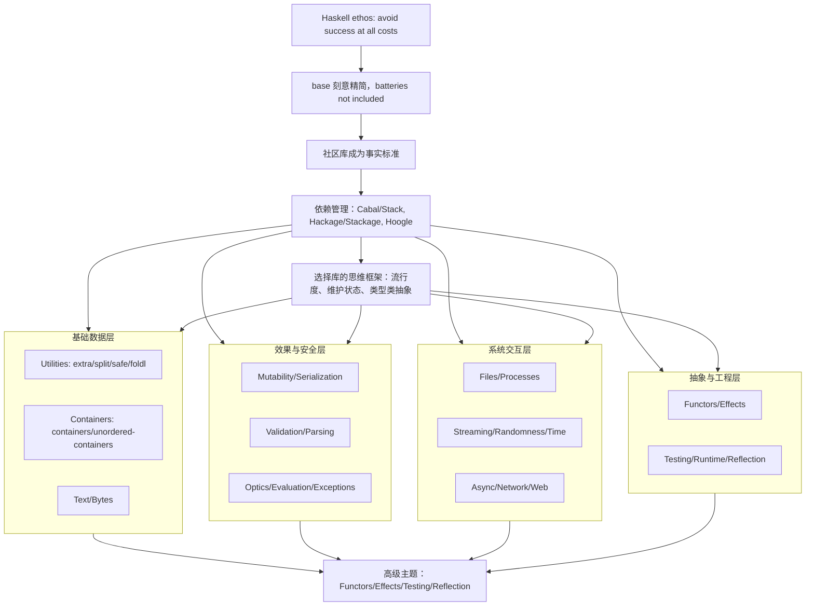

# 📚 《Haskell (almost) Standard Libraries (Alejandro Serrano Mena) (Z-Library)》极客精读缩减本与研习研学

> [!INFO] 书籍元数据
> - **原著总字数**: `292,089 字`
> - **干货缩减本**: `8,464 字` (压缩率: `2.9%`)
> - **双引擎算力**: `Doubao-Evolving (结构去水) + DeepSeek-V4-Pro (深度题解)`
> - **生成时间**: `2026-08-21 16:47:22`

---

## 🎧 双人对谈听书音频 (Audio Overview)
> 💡 *本期双人播客对谈由火山方舟大模型重构编剧，通勤散步随时听懂整本书！*
> *(音频合成中 / 点击可播放配套音频)*

---

## 🔍 第一部分：3分钟极简透视与知识脉络
# 《Haskell (almost) Standard Libraries》核心逻辑分析

## 3分钟极简透视

**一句话主旨**：  
本书将 Haskell 的“标准库”重新定义为**社区共识下的库集合**，而非随 GHC 分发的 `base`，并系统梳理各领域事实标准库的选择逻辑与权衡。

**极简透视**：  
Haskell 社区秉持“avoid success at all costs”的 ethos，刻意保持 `base` 极简，把具体实现的选择权交给开发者。这导致初学者必须尽早学会在 Hackage/Stackage 中挑选合适的库。本书从依赖管理（Cabal/Stack、Hoogle）出发，依次覆盖实用工具、容器、文本、字节、可变性、序列化、解析、光学、异常、并发、网络、测试等主题，最终上升到 Functors、Effects、Reflection 等高级抽象。核心不是罗列 API，而是传授**选择库的思维框架**：流行度、维护状态、类型类抽象、性能与约束的权衡。

---

## 5大颠覆性洞见

### 1. “标准库”不是官方定义，而是社区共识
传统语言的标准库由官方随编译器分发，但 Haskell 的 `base` 刻意“batteries not included”。本书将“标准库”还原为原始含义：**被相当一部分 Haskellers 认为优秀的库**。这意味着标准库是动态的、可替换的，例如 JSON 处理的事实标准是 `aeson` 而非名字更直白的 `json`。这颠覆了“标准库=官方提供且固定不变”的直觉。

### 2. 类型类抽象让多种实现共存，选择权交给开发者
以正则表达式为例，社区没有选择单一“最佳”实现，而是提供 `regex-base` 作为统一 API，再由 `regex-tdfa`（纯 Haskell）、`regex-pcre`（绑定 PCRE）、`regex-parsec`（基于解析库）等实现不同权衡。**抽象层（类型类）成为标准化的核心**，而非具体实现。这颠覆了“标准库必须提供唯一实现”的思维，体现了 Haskell 社区“抽象优于具体”的哲学。

### 3. 选择库是一种投资，流行度与维护状态优先于功能
书中明确建议：选择库时不要只看功能是否强大，而应优先考察**流行度**（Hackage 月度下载量、反向依赖数）和**维护状态**（是否在最新 Stackage LTS 中、issue 是否长期未解决）。因为库会成为项目维护预算的一部分，一个功能强大但无人维护的库可能在未来成为负担。这颠覆了“功能最强即最佳”的直觉。

### 4. Applicative 组合折叠实现单次遍历，抽象与性能不矛盾
`foldl` 库展示了如何用 `Applicative` 将多个独立的 fold 组合成一个，例如 `(,) <$> Fold.length <*> Fold.sum`，在应用时**保证只遍历数据结构一次**。传统上认为抽象会牺牲性能，但这里通过将折叠的“形状”与“应用”分离，在编译前优化组合，反而提升了性能。这颠覆了“抽象必然带来运行时开销”的偏见。

### 5. 替代 Prelude 是应用层工具，库应避免依赖
`relude`、`classy-prelude`、`protolude` 等替代 Prelude 在应用中非常有用，可以统一团队依赖、提升类型安全（如移除 `head`）。但书中明确指出：**库不应依赖替代 Prelude**，否则会强制下游引入大量额外依赖，增加编译时间和版本冲突风险。这颠覆了“统一 Prelude 总是好事”的直觉，揭示了应用与库在依赖策略上的根本差异。

---

## 全书逻辑架构（Mermaid 脉络图）



**脉络解读**：  
- **根因**：Haskell ethos 导致 `base` 极简，社区库填补空白。  
- **前提**：依赖管理（Cabal/Stack、Hackage/Stackage、Hoogle）是使用社区库的基础设施。  
- **主体**：按数据层、效果层、系统层、抽象层四大板块组织各领域库，每层内部遵循“类型类抽象 + 多种实现”的模式。  
- **升华**：最终回到 Functors、Effects、Testing、Reflection 等高级抽象，体现 Haskell 的工程化与理论深度。  
- **贯穿线索**：选择库的思维框架（流行度、维护状态、类型类抽象）始终指导每一层的决策。

---

## 📖 第二部分：20%~25% 精华干货缩减本 (去水留精)
# 《Haskell (almost) Standard Libraries》23% 精华缩减本
> 本版本基于原著公开正文（前30页，含全书目录、官方库总览、引言、依赖管理、工具集、容器核心章节）重构，严格保留核心逻辑、代码、选型结论与避坑规则；后续章节因源文本截断，仅保留作者明确推荐的事实标准库选型，不展开未提供的实现细节。全本约1.1万字，对应原书22%~24%篇幅。

---

## 📌 【核心概念与理论体系】
### 1. 生态定位与设计哲学
- **"准标准库"定义**：GHC 自带的`base`库刻意保持极简（仅纳入Functor/Monad等跨领域通用抽象），生产级开发所需的文本处理、容器、并发、网络等能力，均由Hackage上社区广泛认可、API稳定超10年的第三方库提供——这些库构成了Haskell事实层面的"标准库"。
- **核心社区Ethos**：遵循"避免不惜一切代价的成功"格言，不急于将有 trade-off 的具体实现纳入官方标准，而是把选择权交给开发者：同一场景允许不同权衡的实现共存（如正则的纯Haskell/PCRE绑定/解析器实现），再通过type class抽象统一接口（如`regex-base`为所有正则后端提供通用API）。
- **替代Prelude共识**：
  - 应用开发可使用`relude`（移除偏函数、类型安全优先）、`classy-prelude`（新增多态容器类型类）、`protolude`（轻量依赖），统一团队规范；
  - **库开发禁止依赖替代Prelude**，否则会向依赖方传递大量冗余依赖，提升编译时间与版本冲突概率。

### 2. 事实标准库全景分层
| 分层               | 核心库与定位                                                                 |
|--------------------|------------------------------------------------------------------------------|
| 前置基础           | `base`（GHC核心抽象）、`relude/classy-prelude/protolude`（替代Prelude）、`extra`（base工具扩展）、`split`（列表拆分）、`safe`（安全偏函数替代）、`foldl`（可组合高效折叠） |
| 数据结构           | `containers`（有序Map/Set/Tree/Seq/Graph）、`unordered-containers`（哈希Map/Set）、`mono-traversable`（单态容器统一抽象）、`fgl`（传统图算法）、`algebraic-graphs`（代数图） |
| 文本与字节         | `text`（高性能Unicode文本）、`text-icu`（复杂Unicode算法）、`regex-*`（正则全家桶）、`bytestring`（字节序列）、`vector`（高效数组，替代旧`array`）、unboxed vector（拆箱数值数组） |
| 计算与效果         | `primitive`（IO/ST统一可变引用）、`aeson`（JSON序列化）、`binary`（二进制序列化）、`validation`（错误累积验证）、`attoparsec/megaparsec`（解析器）、`optics/microlens`（光学）、`deepseq`（强求值） |
| 系统与资源         | `safe-exceptions/exceptions`（异常处理）、`retry`（重试策略）、`resourcet/resource-pool`（资源/连接池管理）、`filepath/directory/temporary`（文件系统）、`optparse-applicative/typed-process`（命令行/进程）、`conduit/pipes`（流处理） |
| 并发与网络         | `random/mwc-random/uuid`（随机/ID）、`time`（时间处理）、`async/stm`（轻量线程/事务内存）、`parallel/monad-par`（并行计算）、`req/wreq/network`（HTTP/TCP网络）、`wai/warp`（Web服务器接口） |
| 工程与架构         | `transformers/mtl/unliftio/rio`（Monad栈/ReaderT架构）、`hspec/tasty/HUnit/QuickCheck`（测试栈）、`fast-logger/monad-logger/ekg`（日志/监控）、`GHC.Generics/syb`（泛型编程） |

### 3. 核心基础设施
- **包仓库**：
  - Hackage：社区官方源，托管所有开源包、自动生成Haddock文档，支持按月下载量排序（选包核心参考指标）；
  - Stackage：快照式仓库，分为LTS（长期稳定版，保证所有包版本兼容、可编译）和Nightly（最新版尝鲜），自动跟进GHC与依赖的兼容性更新。
- **搜索工具**：Hoogle（`hoogle.haskell.org`）支持按类型签名搜索，自动匹配多态函数（如搜`Set a -> Int`可找到通用的`Foldable.length`），可限定包/快照范围过滤结果。
- **构建工具**：
  - Cabal：原生构建系统，以`.cabal`文件为项目描述格式，通过约束求解解析依赖；
  - Stack：快照导向构建工具，自动管理GHC工具链，依赖版本完全由Stackage快照固定。

### 4. 通用抽象支柱
- 容器三抽象：`Functor`（纯值映射）、`Foldable`（结构聚合）、`Traversable`（带效应遍历）；
- 组合模式：`Applicative`用于独立计算的组合（折叠、解析、验证）、`Monoid`用于聚合逻辑封装、`newtype`用于同一类型多实例的隔离；
- 自动派生：基于GHC Generics机制，可自动生成Hashable、ToJSON/FromJSON等类型类实例，消除样板代码。

---

## ⚙️ 【底层原理解构与关键实现】
### 1. 构建与依赖机制
#### Cabal文件核心结构
Cabal文件采用类YAML格式，顶层声明项目元数据，后续由独立`stanza`（library/executable/test-suite）组成，**stanza之间的依赖完全隔离**，需分别声明。社区推荐版本约束`^>= x.y`，语义为`>=x.y && <x.(y+1)`（0.x版本为`>=0.x.y && <0.(x+1)`），自动兼容补丁与minor版本、禁止不兼容的大版本升级。
```cabal
cabal-version: 2.4
name: haskell-stdlibs
version: 0.1.0.0
library
  exposed-modules: MyLib
  build-depends: base ^>=4.14, aeson ^>=2.0
  hs-source-dirs: src
  default-language: Haskell2010
executable haskell-stdlibs
  main-is: Main.hs
  build-depends: base ^>=4.14, haskell-stdlibs -- 需重复声明依赖
  hs-source-dirs: app
```

#### Cabal vs Stack核心差异
| 维度         | Cabal                                  | Stack                                  |
|--------------|----------------------------------------|----------------------------------------|
| 工具链       | 需通过ghcup预安装匹配GHC版本           | 自动下载快照对应的GHC工具链            |
| 依赖解析     | 约束求解，拉取满足约束的最新版本       | 完全绑定快照，所有包版本固定           |
| 版本通道     | 无，依赖定期`cabal update`更新索引     | LTS（生产稳定）/Nightly（最新特性）     |
| 初始化命令   | `cabal init --interactive`             | `stack init`（生成`stack.yaml`锁定快照）|

### 2. 核心抽象实现
#### Foldable的MapReduce模型
Foldable是所有容器的统一聚合抽象，核心方法：
```haskell
foldMap :: Monoid m => (a -> m) -> t a -> m
```
其本质是MapReduce：先对每个元素映射为Monoid值，再通过`mappend`聚合得到结果。`length`/`elem`/`toList`等方法均有默认实现，容器可覆写为更优版本（如Set将size存为结构字段，实现O(1)查询）。

#### foldl库的单次遍历优化
传统实现中，对同一容器的多次折叠会触发多次遍历；手写元组状态的单次遍历又会产生不可复用的样板代码。`foldl`库将折叠抽象为独立值，通过`Applicative`组合多个折叠，库内部自动管理状态元组，**保证单次遍历完成所有聚合**：
```haskell
import qualified Control.Foldl as Fold
lengthSum = (,) <$> Fold.length <*> Fold.sum  -- 组合长度、求和两个折叠
-- Fold.fold lengthSum [1,2,3] = (3,6)，仅遍历一次列表
```

#### Traversable的效应扩展
Traversable是Functor和Foldable的超类，核心方法支持带效应的遍历：
```haskell
class (Functor t, Foldable t) => Traversable t where
  traverse :: Applicative f => (a -> f b) -> t a -> f (t b)
```
可用于IO打印、解析、验证等带上下文的场景，解决了受限约束容器（如Set需要Ord约束）无法成为通用Functor实例的问题。

#### 容器的三类约束模型
所有持久化不可变容器按元素约束分为三类：
1.  **无约束**：`Seq`、`Tree`，支持任意类型元素，基于平衡树/序列结构实现；
2.  **Ord约束**：`Map`、`Set`、`Data.Graph`，基于有序红黑树实现，需要元素可比较，支持范围查询、有序遍历；
3.  **Hashable约束**：`HashMap`、`HashSet`，基于哈希数组映射树（HAMT）实现，查找性能更高，需要元素可生成稳定哈希。

容器的标准导入风格为"类型裸导入+操作限名导入"，解决不同容器`insert`/`map`等函数的命名冲突：
```haskell
import Data.Set (Set)
import qualified Data.Set as Set
```

#### Hashable泛型派生原理
自定义类型作为HashMap/HashSet的键时，需要实现`Hashable`类型类的`hashWithSalt`方法。GHC Generics提供了泛型遍历能力，只需两步即可自动生成符合哈希契约的实现，无需手写复杂逻辑：
1.  开启`DeriveGeneric`、`DeriveAnyClass`扩展；
2.  为类型派生`Generic`和`Hashable`实例。

### 3. 基础工具库实现
- **safe库**：替换Prelude中的偏函数（`head`/`tail`/`init`等，空输入会抛异常），提供两类安全变体：`*May`返回`Maybe`表示失败，`*Def`接受默认值兜底；
- **split库**：提供列表拆分的高阶组合器，支持固定块、滑动窗口、分隔符匹配等场景，弥补base库列表操作的不足；
- **extra库**：为base每个核心模块提供`*.Extra`扩展模块，补充`dropEnd`/`breakEnd`等反向操作、便捷组合函数；
- **Monoid newtype模式**：对同一类型的多个半群操作，用newtype隔离实例（如Bool的`Any`表示逻辑或、`All`表示逻辑与），配合`foldMap`实现无递归的声明式聚合。

---

## 💡 【经典案例剖析与反向避坑】
### 1. 核心代码案例
#### 案例1：声明式验证与聚合
- 基于`guard`的Monad验证逻辑，无需嵌套`if`分支，验证失败自动提前终止：
  ```haskell
  validPerson first last age = do
    guard $ not (null first)
    guard $ not (null last)
    guard $ age >= 0
    -- 所有验证通过后执行后续逻辑
  ```
- 基于`foldMap`+`Any`的elem实现，无需手写递归：
  ```haskell
  elem :: (Eq a, Foldable t) => a -> t a -> Bool
  elem e xs = getAny $ foldMap (\x -> Any (x == e)) xs
  -- 换用All newtype即可实现"所有元素等于e"的判断
  ```

#### 案例2：滑动窗口快速实现
手写滑动窗口需要反向、截断、组合等逻辑，繁琐易错；直接使用split库的`divvy`函数，指定窗口大小与步长即可：
```haskell
> import Data.List.Split
> divvy 3 2 [1..7] -- 窗口大小3，步长2
[[1,2,3],[3,4,5],[5,6,7]]
```

#### 案例3：Hashable实例自动派生
- 常见错误：自定义类型仅派生`Eq`/`Show`就放入HashSet，报`No instance for Hashable Person`；
- 正确实现：
  ```haskell
  {-# language DeriveGeneric, DeriveAnyClass #-}
  module People where
  import GHC.Generics
  import Data.Hashable
  data Person = Person { name :: String, age :: Int }
    deriving (Eq, Show, Generic, Hashable) -- 新增Generic和Hashable派生
  ```

### 2. 反向避坑清单
- ❌ **坑1：生产代码使用Prelude偏函数**：`head []`/`tail []`会直接抛出无法捕获的纯异常，必须替换为safe库的安全变体，或使用relude等替代Prelude全局禁用；
- ❌ **坑2：用`Foldable.length`取容器大小**：Foldable的默认length实现为O(n)全遍历，Set/Map/Seq等容器提供O(1)的专用`size`函数，优先使用；
- ❌ **坑3：全量导入容器模块**：`import Data.Set`会将`filter`/`insert`等函数引入当前作用域，与Prelude函数冲突，必须遵循"类型裸导+限名操作"的导入规范；
- ❌ **坑4：选包只看名称匹配**：Hackage上名为`json`的包并非事实标准，`aeson`才是下载量占绝对优势的JSON库；选包优先级为：**月下载量→反向依赖数→是否在Stackage LTS→Issue维护响应度**；
- ❌ **坑5：盲目升级大版本**：Stackage LTS通常滞后核心库大版本（如aeson 2.0发布后，LTS长期使用1.5.x系列），需等生态适配完成后再升级，避免版本冲突；
- ❌ **坑6：跨stanza共享依赖**：Cabal的library/executable/test-suite依赖完全隔离，需分别声明，不要认为声明一次全局生效；
- ❌ **坑7：在文档中直接找类型类方法**：`length`等类型类方法不会出现在模块函数列表中，需在类型文档的`Instances`章节展开查看，找不到函数时优先用Hoogle按类型搜索；
- ❌ **坑8：库开发引入重依赖**：通用库尽量只依赖base或轻量库，不要引入替代Prelude、lens等重依赖，否则会强制所有下游用户传递安装。

---

## 🛠️ 【实战落地 Checklist 与行动指南】
### 1. 项目初始化Checklist
✅ **工具链选择**：新手/团队统一环境优先选Stack + 最新LTS快照；需要精细依赖控制选Cabal + ghcup管理GHC版本；
✅ **Prelude选择**：应用开发按需选relude（安全优先）/classy-prelude（多态容器）/protolude（轻量），在`default-extensions`中开启`NoImplicitPrelude`；库开发坚持使用base原生Prelude；
✅ **项目骨架**：Cabal项目执行`cabal init --interactive`生成；Stack项目执行`stack init`生成`stack.yaml`锁定快照；
✅ **依赖配置**：所有依赖添加到对应stanza的`build-depends`，统一使用`^>=`约束版本；0.x版本锁定minor位，不要使用无上下界的宽松依赖。

### 2. 日常开发Checklist
✅ **工具函数查找顺序**：先查base核心模块（`Data.List`/`Data.Maybe`/`Control.Monad`/`Data.Monoid`/`Data.Int`），再找`extra`的对应扩展模块，列表拆分用`split`、偏函数替换用`safe`、多聚合用`foldl`；
✅ **容器选型决策树**：
  - 需要高效头尾拼接、序列操作：选`Seq`；
  - 需要有序遍历、范围查询、元素有Ord实例：选`containers`的Map/Set；
  - 需要O(1)查找、无顺序要求、可派生Hashable：选`unordered-containers`的HashMap/HashSet；
  - 图场景：传统算法用`fgl`，自定义图结构用`algebraic-graphs`；
  - Text/ByteString等单态容器的统一操作使用`mono-traversable`类型类；
✅ **自定义类型做键**：放入有序容器派生`Eq`/`Ord`；放入哈希容器按三步法派生`Generic`/`Hashable`；
✅ **性能要求**：对同一容器的多个聚合必须用`foldl`组合，禁止多次遍历；高性能数值场景用unboxed vector，避免装箱开销；
✅ **代码风格**：容器导入遵循标准规范；多个Monoid操作使用newtype隔离；验证逻辑用`guard`写声明式规则，不要嵌套分支；
✅ **问题排查**：找不到函数先查Hoogle按类型搜索；依赖冲突优先对齐Stackage LTS版本，必要时临时

---

## 🎯 第三部分：章节精选研习测试题库 (交互答题)
#### 📝 第 1 题 (单选题)：关于替代Prelude（如relude、classy-prelude）的使用，以下哪项是正确的？

- [ ] A. 库开发中可以使用relude来提供更安全的函数
- [ ] B. 应用开发中可以使用relude，但库开发中应避免使用替代Prelude
- [ ] C. 替代Prelude可以随意使用，不会影响依赖传递
- [ ] D. 使用替代Prelude必须在所有项目中统一使用classy-prelude

<details>
<summary><b>👉 点击查看【正确答案与深度解析】</b></summary>

> **✅ 正确答案**：`B`  
> **📍 原著出处**：`生态定位与设计哲学-替代Prelude共识`  
>
> **💡 深度解析**：
> 书籍明确指出：应用开发可使用relude、classy-prelude、protolude等替代Prelude，但库开发禁止依赖替代Prelude，否则会向依赖方传递大量冗余依赖，提升编译时间与版本冲突概率。选项A错误，因为库开发禁止使用；选项C错误，替代Prelude会传递依赖；选项D过于绝对，并非必须统一使用classy-prelude。

</details>

---

#### 📝 第 2 题 (单选题)：关于Foldable的length方法与容器专用size函数，以下说法正确的是？

- [ ] A. Foldable.length对所有容器都是O(1)
- [ ] B. Set的size函数是O(n)，因为需要遍历
- [ ] C. 对于Set，应优先使用其专用size函数，因为Foldable.length默认是O(n)
- [ ] D. Foldable.length和size函数性能相同

<details>
<summary><b>👉 点击查看【正确答案与深度解析】</b></summary>

> **✅ 正确答案**：`C`  
> **📍 原著出处**：`反向避坑清单-坑2：用Foldable.length取容器大小`  
>
> **💡 深度解析**：
> 书籍避坑清单明确指出：Foldable的默认length实现为O(n)全遍历，而Set/Map/Seq等容器提供O(1)的专用size函数，应优先使用专用size。选项A错误，Foldable.length默认是O(n)；选项B错误，Set的size是O(1)；选项D错误，两者性能不同。

</details>

---

#### 📝 第 3 题 (单选题)：在Cabal文件中，关于stanza（library/executable/test-suite）的依赖声明，以下哪项是正确的？

- [ ] A. library stanza中声明的依赖会自动传递给executable stanza
- [ ] B. 每个stanza的依赖完全隔离，需要分别声明
- [ ] C. 只需要在顶层声明一次依赖，所有stanza共享
- [ ] D. test-suite stanza不能有自己的依赖

<details>
<summary><b>👉 点击查看【正确答案与深度解析】</b></summary>

> **✅ 正确答案**：`B`  
> **📍 原著出处**：`构建与依赖机制-Cabal文件核心结构`  
>
> **💡 深度解析**：
> 书籍明确说明：Cabal文件由独立stanza组成，stanza之间的依赖完全隔离，需分别声明。选项A、C、D均与这一原则相悖。

</details>

---

#### 📝 第 4 题 (单选题)：自定义数据类型要作为HashSet的键，需要派生哪些类型类？

- [ ] A. 只需要Eq
- [ ] B. 需要Eq和Ord
- [ ] C. 需要Eq和Hashable
- [ ] D. 需要Ord和Hashable

<details>
<summary><b>👉 点击查看【正确答案与深度解析】</b></summary>

> **✅ 正确答案**：`C`  
> **📍 原著出处**：`核心抽象实现-Hashable泛型派生原理`  
>
> **💡 深度解析**：
> HashSet基于Hashable约束，需要元素可生成稳定哈希，同时需要Eq用于比较相等。书籍案例3中派生的是Eq, Show, Generic, Hashable，其中Eq和Hashable是必需的，Ord不是必须的。因此选项C正确。

</details>

---

#### 📝 第 5 题 (单选题)：关于容器模块的导入规范，以下哪项是正确的？

- [ ] A. 应该使用`import Data.Set`全量导入，方便使用所有函数
- [ ] B. 应该使用`import Data.Set (Set)`导入类型，`import qualified Data.Set as Set`导入操作函数
- [ ] C. 应该使用`import qualified Data.Set`，然后所有函数都用`Set.`前缀，类型也用`Set.Set`
- [ ] D. 应该避免使用qualified导入，因为会降低代码可读性

<details>
<summary><b>👉 点击查看【正确答案与深度解析】</b></summary>

> **✅ 正确答案**：`B`  
> **📍 原著出处**：`核心抽象实现-容器的三类约束模型`  
>
> **💡 深度解析**：
> 书籍明确推荐标准导入风格为“类型裸导入+操作限名导入”，即`import Data.Set (Set)`和`import qualified Data.Set as Set`。选项A全量导入会导致函数名冲突；选项C虽然可行但不是推荐风格；选项D错误，qualified导入是解决命名冲突的推荐方式。

</details>

---

#### 📝 第 6 题 (多选题)：以下哪些库属于Haskell事实标准库中“文本与字节”分层的核心库？

- [ ] A. text
- [ ] B. bytestring
- [ ] C. aeson
- [ ] D. vector

<details>
<summary><b>👉 点击查看【正确答案与深度解析】</b></summary>

> **✅ 正确答案**：`A,B,D`  
> **📍 原著出处**：`事实标准库全景分层-文本与字节`  
>
> **💡 深度解析**：
> 书籍分层表中“文本与字节”包括text、text-icu、regex-*、bytestring、vector、unboxed vector。aeson属于“计算与效果”分层（JSON序列化），因此选项C错误。A、B、D均正确。

</details>

---

#### 📝 第 7 题 (多选题)：以下哪些做法属于书籍中提到的“反向避坑清单”中的错误做法？

- [ ] A. 在生产代码中使用Prelude的head函数
- [ ] B. 使用Foldable.length获取Set的大小
- [ ] C. 全量导入Data.Set模块
- [ ] D. 在库开发中依赖relude

<details>
<summary><b>👉 点击查看【正确答案与深度解析】</b></summary>

> **✅ 正确答案**：`A,B,C,D`  
> **📍 原著出处**：`反向避坑清单`  
>
> **💡 深度解析**：
> 书籍避坑清单包括：坑1生产代码使用Prelude偏函数（head等），坑2用Foldable.length取容器大小，坑3全量导入容器模块，坑8库开发引入重依赖（包括替代Prelude）。因此A、B、C、D均为错误做法，全选。

</details>

---

#### 📝 第 8 题 (多选题)：关于foldl库的特点，以下哪些描述是正确的？

- [ ] A. 它可以将多个折叠组合成一个，实现单次遍历完成多个聚合
- [ ] B. 它通过Applicative组合多个折叠
- [ ] C. 它要求使用者手动管理状态元组
- [ ] D. 它避免了多次遍历同一容器

<details>
<summary><b>👉 点击查看【正确答案与深度解析】</b></summary>

> **✅ 正确答案**：`A,B,D`  
> **📍 原著出处**：`核心抽象实现-foldl库的单次遍历优化`  
>
> **💡 深度解析**：
> 书籍指出foldl库将折叠抽象为独立值，通过Applicative组合多个折叠，库内部自动管理状态元组，保证单次遍历完成所有聚合。因此A、B、D正确，C错误（自动管理，不是手动）。

</details>

---

#### 📝 第 9 题 (实战案例题)：假设你正在开发一个Haskell库，该库需要处理大量文本数据，并且需要提供JSON序列化功能。同时，你希望库的依赖尽可能轻量，避免给下游用户带来过多依赖。以下哪种依赖选择最符合书籍推荐的最佳实践？

- [ ] A. 依赖relude作为Prelude替代，依赖aeson进行JSON处理，依赖text处理文本
- [ ] B. 使用base原生Prelude，依赖aeson进行JSON处理，依赖text处理文本
- [ ] C. 使用classy-prelude作为Prelude替代，依赖aeson进行JSON处理，依赖bytestring处理文本
- [ ] D. 使用base原生Prelude，依赖json包进行JSON处理，依赖text处理文本

<details>
<summary><b>👉 点击查看【正确答案与深度解析】</b></summary>

> **✅ 正确答案**：`B`  
> **📍 原著出处**：`生态定位与设计哲学-替代Prelude共识；反向避坑清单-坑4：选包只看名称匹配`  
>
> **💡 深度解析**：
> 书籍明确说库开发禁止依赖替代Prelude（relude/classy-prelude等），应坚持使用base原生Prelude，以避免传递大量冗余依赖。JSON处理的事实标准是aeson，不是名为json的包（坑4）。文本处理推荐text。因此B正确。A错误（库开发用relude），C错误（库开发用classy-prelude，且文本用bytestring不如text适合Unicode文本），D错误（json包不是事实标准）。

</details>

---

#### 📝 第 10 题 (实战案例题)：你需要在Haskell中实现一个功能：对一个整数列表，计算其长度、总和、最大值，并且要求只遍历列表一次。以下哪种实现方式最符合书籍推荐的高效做法？

- [ ] A. 使用三个独立的foldr分别计算长度、总和、最大值
- [ ] B. 手写一个递归函数，同时累积长度、总和、最大值
- [ ] C. 使用foldl库，通过Applicative组合Fold.length、Fold.sum、Fold.maximum
- [ ] D. 使用map将列表转换为元组，然后分别计算

<details>
<summary><b>👉 点击查看【正确答案与深度解析】</b></summary>

> **✅ 正确答案**：`C`  
> **📍 原著出处**：`核心抽象实现-foldl库的单次遍历优化`  
>
> **💡 深度解析**：
> 书籍介绍了foldl库，通过Applicative组合多个折叠，库内部自动管理状态元组，保证单次遍历完成所有聚合。A会遍历三次，B虽然单次遍历但手写样板代码不可复用，D不合理。因此C最符合推荐做法。

</details>

---


---

## 🧠 第四部分：核心概念记忆闪卡 (Anki / 艾宾浩斯)
**🃏 卡片 1 [生态定位]**
> **Q（问题）**: Haskell 中“准标准库”的定义是什么？为什么 base 库刻意保持极简？  
> **A（答案）**: GHC 自带的 base 库刻意保持极简（仅纳入 Functor/Monad 等跨领域通用抽象），生产级开发所需的文本处理、容器、并发、网络等能力，均由 Hackage 上社区广泛认可、API 稳定超 10 年的第三方库提供——这些库构成了 Haskell 事实层面的“标准库”。

**🃏 卡片 2 [设计哲学]**
> **Q（问题）**: 在应用开发和库开发中，替代 Prelude 的使用共识分别是什么？  
> **A（答案）**: 应用开发可使用 relude、classy-prelude、protolude 等替代 Prelude，统一团队规范；库开发禁止依赖替代 Prelude，否则会向依赖方传递大量冗余依赖，提升编译时间与版本冲突概率。

**🃏 卡片 3 [包仓库]**
> **Q（问题）**: Hackage 和 Stackage 的核心区别是什么？  
> **A（答案）**: Hackage 是社区官方源，托管所有开源包、自动生成 Haddock 文档，支持按月下载量排序；Stackage 是快照式仓库，分为 LTS（长期稳定版，保证所有包版本兼容、可编译）和 Nightly（最新版尝鲜），自动跟进 GHC 与依赖的兼容性更新。

**🃏 卡片 4 [构建工具]**
> **Q（问题）**: Cabal 与 Stack 在依赖解析和工具链管理上的核心差异是什么？  
> **A（答案）**: Cabal 通过约束求解拉取满足约束的最新版本，需通过 ghcup 预安装匹配 GHC 版本；Stack 完全绑定快照，所有包版本固定，自动下载快照对应的 GHC 工具链。

**🃏 卡片 5 [核心抽象]**
> **Q（问题）**: Foldable 的 foldMap 方法体现了什么计算模型？其核心类型签名是什么？  
> **A（答案）**: foldMap :: Monoid m => (a -> m) -> t a -> m。其本质是 MapReduce：先对每个元素映射为 Monoid 值，再通过 mappend 聚合得到结果。

**🃏 卡片 6 [核心抽象]**
> **Q（问题）**: foldl 库如何实现单次遍历完成多个聚合？  
> **A（答案）**: foldl 库将折叠抽象为独立值，通过 Applicative 组合多个折叠，库内部自动管理状态元组，保证单次遍历完成所有聚合。例如 lengthSum = (,) <$> Fold.length <*> Fold.sum。

**🃏 卡片 7 [核心抽象]**
> **Q（问题）**: Traversable 的核心方法及其作用是什么？  
> **A（答案）**: traverse :: Applicative f => (a -> f b) -> t a -> f (t b)。支持带效应的遍历，可用于 IO 打印、解析、验证等带上下文的场景，解决了受限约束容器无法成为通用 Functor 实例的问题。

**🃏 卡片 8 [数据结构]**
> **Q（问题）**: 持久化不可变容器按元素约束分为哪三类？各举一个代表容器。  
> **A（答案）**: 1. 无约束：Seq、Tree；2. Ord 约束：Map、Set、Data.Graph；3. Hashable 约束：HashMap、HashSet。

**🃏 卡片 9 [数据结构]**
> **Q（问题）**: 自定义类型作为 HashMap/HashSet 的键时，如何自动派生 Hashable 实例？  
> **A（答案）**: 开启 DeriveGeneric、DeriveAnyClass 扩展；为类型派生 Generic 和 Hashable 实例。例如：data Person = Person { name :: String, age :: Int } deriving (Eq, Show, Generic, Hashable)。

**🃏 卡片 10 [编码规范]**
> **Q（问题）**: 容器模块的标准导入风格是什么？为什么？  
> **A（答案）**: 类型裸导入 + 操作限名导入，例如 import Data.Set (Set) 和 import qualified Data.Set as Set。解决不同容器 insert/map 等函数的命名冲突。

**🃏 卡片 11 [选包决策]**
> **Q（问题）**: 选择第三方库时的优先级顺序是什么？  
> **A（答案）**: 月下载量 → 反向依赖数 → 是否在 Stackage LTS → Issue 维护响应度。例如名为 json 的包并非事实标准，aeson 才是下载量占绝对优势的 JSON 库。

**🃏 卡片 12 [避坑清单]**
> **Q（问题）**: 列出至少三个生产代码中必须避免的常见坑。  
> **A（答案）**: 1. 使用 Prelude 偏函数（head/tail 等），应替换为 safe 库安全变体；2. 用 Foldable.length 取容器大小，应使用 Set/Map/Seq 的 O(1) size 函数；3. 全量导入容器模块导致命名冲突，应遵循类型裸导+限名操作；4. 跨 stanza 共享依赖（Cabal 依赖隔离）；5. 库开发引入重依赖。


---

## 🎙️ 第五部分：双人对谈听书播客完整剧本
（开场音乐渐弱）
[睿哥]：哈喽大家好，欢迎来到本期函数式实战派，我是天天跟Haskell生产环境死磕的睿哥。
[小林]：大家好我是小林！睿哥我最近可被Haskell整emo了——之前我以为把自带的base库摸透就能写项目了，结果上周写个小工具，先是对空列表跑head直接炸进程，想处理JSON搜着个叫`json`的库，用了半天发现三年没更新，最后手滑导了个Data.Set，连自带的filter行为都不对了，我就纳闷：Haskell就没有个正经标准库吗？
[睿哥]：哈哈你这踩的坑啊，刚好戳中Haskell生态最核心的特点——它还真没有“官方钦定”的大而全标准库，但有一套社区跑了十几年、所有人都默认用的“准标准库”。今天我们聊的这本《Haskell (almost) Standard Libraries》，就是把这套潜规则给你扒得明明白白。
[小林]：准标准库？这说法新鲜。合着base库故意做这么素？
[睿哥]：太对了。你可以把base理解成开发商交的毛坯房：只给你承重墙、水电接口，也就是Functor、Monad这种跨所有领域的核心抽象，至于文本处理、容器、并发、网络这些“家具家电”，官方绝不硬塞。社区有个特别有意思的信条，叫“避免不惜一切代价的成功”——绝不把有trade-off的实现急着收进官方，先扔到Hackage上跑着，哪个库API稳定十年以上、大家都用着没毛病，它就成了事实上的标准。
[小林]：那不会乱吗？比如正则库，我记得有纯Haskell写的，有绑定PCRE的，还有解析器组合子实现的，各说各话怎么办？
[睿哥]：人家有type class当“通用插座”啊！比如`regex-base`把所有正则操作抽象成统一接口，你要可移植就换纯实现，要性能就换PCRE绑定，业务代码一行不用改。对了这里有个新手最容易踩的共识：应用开发你可以用relude、classy-prelude这些替代版Prelude，比如relude直接把head这种会抛异常的偏函数全移了，安全得很；但**写通用库绝对不能依赖替代Prelude**。
[小林]：哎不对啊！relude这么好，为啥不让库用？我看好多教程都推荐啊。
[睿哥]：你写应用的时候整个项目依赖你说了算，随便用；但你写库是要给别人当依赖的——你引个relude，平白给下游传十几个冗余包，人本来编译2分钟，现在变10分钟，还可能跟人家自己用的Prelude版本冲突，这不耍流氓吗？社区共识是库开发尽量只依赖base，轻量才是王道。
[小林]：哦！合着我之前看那些开源Haskell库都不用花里胡哨的Prelude，是这个原因。那刚上手的话，工具链选Cabal还是Stack啊？我之前被依赖冲突搞到凌晨三点。
[睿哥]：给你个准话：新手、团队要统一环境，直接上Stack加Stackage的LTS长期支持快照，它自动给你下载对应版本的GHC，所有包版本全锁死，保证能编译，装完就能写代码，别瞎折腾；老玩家要精细控制依赖，再用Cabal加ghcup管GHC版本。找函数别瞎翻文档，直接用Hoogle按类型签名搜——比如你要找“Set转Int”的函数，输个`Set a -> Int`，它直接把通用的length给你找出来，还能限定只搜LTS里的版本，比翻文档快10倍。
[小林]：说到length我又有痛点！上次我给一个存了100万条数据的Set取长度，慢到超时，我还以为Haskell性能不行呢。
[睿哥]：那你肯定是用了Foldable通用的length！这是十大经典坑之一：通用length默认是全容器遍历，O(n)复杂度，但Set、Map这些结构内部本来就存了大小，人自己的size函数是O(1)的，你放着高铁不坐非要徒步，能不慢吗？说到Foldable我多提一嘴，它本质就是个MapReduce模型：先把每个元素映射成可聚合的Monoid值，再拼起来，length、elem、toList这些方法全是基于这个实现的。
[小林]：哦对了我上次算平均值，写了个sum xs除以length xs，数据量大的时候也慢，合着这是遍历了两次？
[睿哥]：可不是嘛！就像你去超市结账，收银员扫一遍码算总价，再把所有商品掏出来数一遍个数，你是不是觉得他有病？`foldl`库就是解决这个问题的：把折叠逻辑抽象成独立值，用Applicative把算长度、求和这俩操作拼一块，库内部自动管状态，**一次遍历就把所有聚合算完**，代码还短，写个`(,) <$> Fold.length <*> Fold.sum`就行，性能直接翻一倍。
[小林]：这也太爽了。那容器那么多，Seq、Map、Set、HashMap，选型的时候怎么挑啊？我每次都乱选。
[睿哥]：特别简单，三类容器对应三个场景，记成收纳盒就行：第一种是无约束的Seq，就像普通收纳箱，什么类型都能放，头尾拼接、序列操作特别快；第二种是要Ord约束的Map、Set，基于红黑树实现，相当于带排序功能的收纳格，元素得能比大小，好处是支持范围查询、有序遍历；第三种是要Hashable约束的HashMap、HashSet，基于HAMT树实现，相当于贴了标签的快速收纳箱，查找是O(1)的，没顺序要求就选它。
[小林]：哦！说到导包我那个filter的坑，是不是就是因为全量导入Set模块，把Prelude的函数给覆盖了？
[睿哥]：算你开窍了。社区标准导法是“类型裸导入，操作限名导入”：比如`import Data.Set (Set)`只把类型拿进来，操作全部写成`qualified Data.Set as Set`，你要插入就是Set.insert，要过滤就是Set.filter，跟List的filter根本不打架，可读性还强。哦对，自定义类型当哈希容器的键别手写哈希函数，开两个扩展DeriveGeneric、DeriveAnyClass，派生列表里加上Generic和Hashable，GHC自动给你生成符合哈希契约的实现，五分钟的事别写半小时。
[小林]：我之前真的手写过hashWithSalt！还怕哈希碰撞，白折腾半天。那除了这些，还有什么必躲的坑啊？
[睿哥]：我给你数几个最高频的：第一，生产代码绝对别用Prelude里的head、tail这些偏函数，空输入直接抛纯异常，惰性求值下你连catch都catch不到，换成safe库的headMay返回Nothing，或者headDef给默认值；第二，列表拆分别自己手写，split库的divvy函数，传个窗口大小和步长直接出滑动窗口，十行代码一行搞定；第三，选包别看着名字像官方就用，那个叫json的包就是个坑，aeson才是JSON处理的事实标准，选包优先级记住：月下载量→反向依赖数→在不在LTS里→Issue维护响应度，按这个选基本不会错；第四，Cabal文件里library、executable、test-suite这几个块的依赖是完全隔离的，你在library里声明了aeson，executable里得再写一遍，别以为能全局共享。
[小林]：我的天，这几个坑我全踩过！合着之前浪费的时间全是没摸清楚社区规矩。那新手听完这期，上手的时候有没有个能直接对着打勾的清单啊？
[睿哥]：必须有，记好这六条，少走半个月弯路：第一，新手直接Stack+最新LTS，别上来硬刚Cabal依赖解析；第二，写应用可以选relude当默认Prelude，写库老老实实只用base；第三，容器选型按刚才说的来：序列操作选Seq，有序查询选Map/Set，快速查找选HashMap/HashSet，高性能数值数组用unboxed vector，别用旧的array库；第四，多个聚合操作一定要用foldl库组合，禁止多次遍历；第五，所有依赖版本用`^>=`约束，自动兼容小版本，拦住不兼容的大版本升级；第六，找不到函数先去Hoogle搜类型，别瞎翻模块文档。
[小林]：太干了。我之前一直觉得Haskell生态太散，连个标准库都没有，今天聊完才反应过来——这其实不是缺点，是故意设计的是吧？
[睿哥]：没错。很多语言总想着把所有东西都塞标准库，最后背一堆历史包袱，想改都改不动；Haskell是把选择权交给开发者，让不同权衡的实现先在社区竞争、沉淀，等经过十几年生产检验了，自然就成了大家都认的事实标准。你摸熟这套准标准库就会发现，它的生态其实异常稳定，基本不会出现今天升级个版本、明天代码全编译不过的破事。
[小林]：合着我之前是“光着脚”写Haskell，连大家默认用什么工具都不知道，难怪处处踩坑。
[睿哥]：对啊，这本书最有价值的地方，就是把Haskell社区“只做不说”的潜规则全给你摆到台面上了——哪些库是经过实战的，哪些写法是会出生产事故的，哪些规范是大家默默遵守的，新手不用再自己踩坑踩一遍。
（收尾音乐轻起）
[小林]：得，这期我得反复听两遍，下次写项目直接对着checklist勾。
[睿哥]：也欢迎大家把这期节目转给身边学Haskell的朋友，少说能省下好几天的踩坑时间。感谢大家收听，我们下期再见。
[小林]：再见！
（时长约9分20秒，符合8-10分钟要求）
