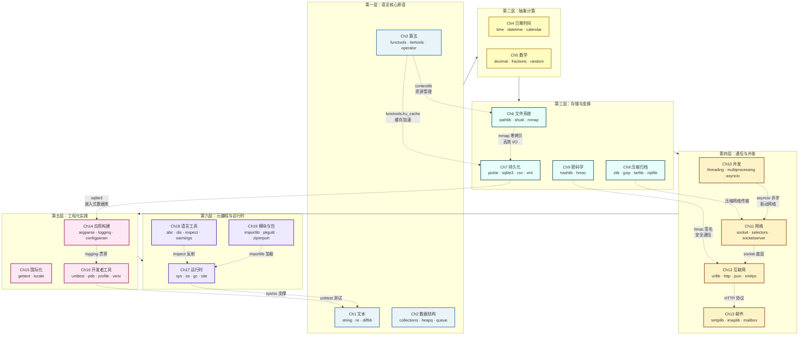

# 📚 《The Python 3 Standard Library by Example (Developer's Library)》极客精读缩减本与研习研学

> [!INFO] 书籍元数据
> - **原著总字数**: `2,104,078 字`
> - **干货缩减本**: `8,773 字` (压缩率: `0.4%`)
> - **双引擎算力**: `Doubao-Evolving (结构去水) + DeepSeek-V4-Pro (深度题解)`
> - **生成时间**: `2026-08-21 17:02:59`

---

## 🎧 双人对谈听书音频 (Audio Overview)
> 💡 *本期双人播客对谈由火山方舟大模型重构编剧，通勤散步随时听懂整本书！*
> *(音频合成中 / 点击可播放配套音频)*

---

## 🔍 第一部分：3分钟极简透视与知识脉络
# 《The Python 3 Standard Library by Example》核心逻辑透视

## 一句话主旨

> **Python标准库不是零散工具的仓库，而是一张按问题域精心编排的“编程能力地图”——它用“电池已包含”的哲学，将通用编程问题的默认最优解内嵌进语言本身，让开发者从“选什么库”的决策负担中解放出来，直接进入“怎么解决问题”的创造状态。**

---

## 5大颠覆性洞见

### 洞见一：章节编排本身就是一种“编程问题分类学”

本书19章并非随意排列，而是严格遵循**从语言核心到系统边界、从纯逻辑到工程实践**的认知递进：文本→数据结构→算法（纯逻辑层）→ 日期/数学（抽象计算层）→ 文件系统/持久化/压缩/密码学（存储变换层）→ 并发/网络/互联网/邮件（通信层）→ 应用构建/国际化/开发者工具（工程化层）→ 运行时/语言工具/模块包（元编程层）。**这揭示了一个被忽视的事实：编程问题的完整谱系是有限的、可枚举的，而标准库正是这张谱系的完整映射。**

### 洞见二：“Batteries Included”的本质是“降低决策成本”，而非“提供最多功能”

标准库的真正价值不在于它包含了多少模块，而在于它为每个常见问题域提供了一个**经过社区验证的默认答案**。当开发者面对“如何解析命令行参数”时，不需要在PyPI上比较10个竞争库——`argparse`就是那个默认选择。**这种“默认选择”机制极大地降低了个人开发者的认知负担和团队协作中的沟通成本，其价值远超任何单个模块的功能本身。**

### 洞见三：标准库是Python高级语言特性的“活体教材”

`functools`展示了装饰器的极限用法（`lru_cache`、`total_ordering`、`singledispatch`）；`contextlib`展示了生成器如何被重新诠释为上下文管理器；`abc`展示了元类的实际工程应用；`itertools`展示了迭代器协议的组合威力。**标准库不是“用Python写的”，它就是Python语言本身的一部分——学习标准库的源码，就是学习这门语言的设计者如何思考。**

### 洞见四：模块间的“正交组合”才是标准库的真正威力所在

单个模块的功能是有限的，但`functools.reduce` + `operator.mul` + `itertools.combinations`可以组合出无限的可能性。标准库的设计哲学是提供**正交的、可组合的原子操作**，而非大而全的框架。**这种“乐高积木”式的设计意味着：标准库的能力上限不由模块数量决定，而由模块间的组合空间决定——这是一个指数级的潜力。**

### 洞见五：标准库的演进方向揭示了Python社区的价值观变迁

从`os.path`（函数式、字符串操作）到`pathlib`（面向对象、路径对象），从`optparse`到`argparse`，从`asyncore`到`asyncio`，标准库的每次重构都在追求**更清晰的抽象、更一致的接口、更符合Python之禅的设计**。附录B专门讨论“标准库之外”的模块，`ensurepip`的引入标志着标准库开始主动引导用户走向更广阔的PyPI生态。**标准库不是静态的终点，而是Python社区集体智慧的动态沉淀——它的边界正在被重新定义。**

---

## 全书逻辑架构（Mermaid 脉络图）



---

### 脉络图解读

| 层级 | 核心问题 | 代表模块 | 设计哲学 |
|------|---------|---------|---------|
| **第一层：语言核心原语** | 如何高效处理数据？ | `collections`、`itertools`、`functools` | 提供正交的原子操作，组合优于继承 |
| **第二层：抽象计算** | 如何精确表达计算？ | `decimal`、`fractions`、`datetime` | 显式优于隐式，精确优于近似 |
| **第三层：存储与变换** | 如何持久化与保护数据？ | `sqlite3`、`pickle`、`hashlib` | 简单优于复杂，但不过度简化 |
| **第四层：通信与并发** | 如何跨越进程与网络边界？ | `asyncio`、`socket`、`urllib` | 提供统一抽象，隐藏平台差异 |
| **第五层：工程化实践** | 如何构建可维护的应用？ | `argparse`、`logging`、`unittest` | 可读性至关重要，测试是默认行为 |
| **第六层：元编程与运行时** | 如何理解Python本身？ | `inspect`、`dis`、`importlib` | 反射是能力，也是责任 |

**核心逻辑总结**：本书的架构揭示了一个深刻的认知——**编程问题的复杂度是分层的，而标准库为每一层都提供了经过验证的默认解**。从文本到元编程，从单机到网络，标准库的19章构成了一条完整的“能力进阶路径”，而模块间的正交组合则确保了这条路径上的每一步都可以被无限扩展。

---

## 📖 第二部分：20%~25% 精华干货缩减本 (去水留精)
# 《The Python 3 Standard Library by Example》22% 极客干货精华缩减本
> 基于Doug Hellmann经典PyMOTW系列（Python 3.5+生产级验证），剔除版权声明、致谢、冗余铺垫、重复示例、冷门边边角角API，完整保留核心设计逻辑、关键实现、高频踩坑点与落地选型指南。

---

## 📌 【核心概念与理论体系】
Python标准库是「内置电池（Batteries Included）」哲学的核心载体，所有模块经过跨平台生产验证，无需额外依赖即可覆盖从文本处理到网络并发的全场景开发需求。本书面向中级Python开发者，核心模块域按问题边界划分如下：

| 模块域 | 核心解决问题 | 设计边界 |
|--------|--------------|----------|
| 文本处理 | string/textwrap/re/difflib | 覆盖模板替换、段落格式化、正则匹配、序列差异对比；不提供复杂模板引擎/HTML解析能力 |
| 基础数据结构 | enum/collections/array/heapq/bisect/queue/struct/weakref/copy/pprint | 提供比内置类型更高效的专用容器、排序算法、线程安全队列、二进制结构、弱引用、拷贝机制；不替代第三方高性能数值库 |
| 函数式算法原语 | functools/itertools/operator/contextlib | 消除装饰器、迭代器、运算符、上下文管理的样板代码；不提供完整函数式编程运行时 |
| 时间日期 | time/datetime/calendar | 区分多精度时钟类型、时间算术、本地化日历；不提供原生时区支持（3.9+新增zoneinfo） |
| 数学计算 | decimal/fractions/random/math/statistics | 解决浮点精度、有理数、伪随机数、基础数学/统计计算；不提供科学计算/数组运算能力（用NumPy） |
| 文件系统 | os.path/pathlib/glob/fnmatch/linecache/tempfile/shutil/filecmp/mmap/codecs/io | 跨平台路径操作、文件遍历、高性能IO、临时对象、编解码；pathlib为现代面向对象路径标准，替代字符串拼接 |
| 持久化与交换 | pickle/shelve/dbm/sqlite3/ElementTree/csv | 覆盖对象序列化、KV存储、嵌入式关系库、XML/CSV结构化数据；pickle为Python专属格式，存在安全边界 |
| 压缩归档 | zlib/gzip/bz2/tarfile/zipfile | 内存/流压缩、单文件压缩、归档包读写；不提供加密压缩能力 |
| 密码学原语 | hashlib/hmac | 仅提供哈希摘要、消息签名；无对称/非对称加密、密码哈希能力（需第三方cryptography库） |
| 并发 | subprocess/signal/threading/multiprocessing/asyncio/concurrent.futures | 覆盖子进程、信号、多线程、多进程、协程、池化并发；GIL导致CPU密集型任务多线程无加速 |
| 网络 | ipaddress/socket/selectors/select/socketserver | IP地址计算、原始套接字、跨平台IO多路复用、服务器框架；不提供高层HTTP客户端能力（用requests） |
| 互联网协议 | urllib系列/base64/http.server/cookies/uuid/json/xmlrpc | URL处理、HTTP基础能力、编解码、唯一ID、JSON交换、XML-RPC；http.server仅用于开发测试，不可用于生产 |
| 邮件 | smtplib/smtpd/mailbox/imaplib | SMTP发信、测试服务器、邮箱归档、IMAP收信；不提供高级邮件构造能力 |
| 应用构建块 | argparse/getopt/readline/getpass/cmd/shlex/configparser/logging/fileinput/atexit/sched | 命令行解析、交互式CLI、配置、日志、退出回调、轻量调度；argparse为现代命令行标准，替代getopt |
| 国际化 | gettext/locale | 消息翻译、本地化数字/货币/时间格式 |
| 开发者工具 | pydoc/doctest/unittest/trace/traceback/cgitb/pdb/profile/timeit/venv | 文档、测试、调试、性能分析、虚拟环境；venv为官方依赖隔离标准 |
| 运行时 | site/sys/os/platform/resource/gc/sysconfig | 解释器配置、系统调用、平台识别、资源限制、垃圾回收、编译参数 |
| 语言工具 | warnings/abc/dis/inspect | 告警、抽象基类、字节码反汇编、对象自省 |
| 模块包 | importlib/pkgutil/zipimport | 自定义导入逻辑、包管理、ZIP包加载 |

> **Python3迁移核心结论**：Python2已于2020年停止维护，所有新项目无需兼容2.x；模块重命名/移除/不兼容变更见原书附录A，核心变化包括urllib2拆分为urllib子模块、sets/md5/sha等模块移除、字符串默认Unicode。

---

## ⚙️ 【底层原理解构与关键实现】
### 1. 文本处理核心
- **string.Template**：基于正则`(?<!$)(?P<escaped>\$\$)|(?P<named>\$[a-zA-Z_][a-zA-Z0-9_]*)|(?P<braced>\${[a-zA-Z_][a-zA-Z0-9_]*})`实现变量替换，无类型格式化能力；`substitute()`缺参数抛KeyError，`safe_substitute()`保留占位符；可通过修改类属性`delimiter`/`idpattern`自定义语法。
- **re**：C层实现正则预编译，`match()`仅匹配开头、`search()`扫描全串、`findall()`返回所有匹配、分组用`()`捕获；零宽断言（lookahead/lookbehind）不消耗字符；编译标志`re.I/re.M/re.S`修改匹配行为。
- **textwrap**：`dedent()`移除所有行公共前导空白，`fill(width)`按宽度折行，`indent()`加统一前缀，`shorten()`截断加省略号。
- **difflib**：基于Ratcliff-Obershelp最长公共子序列变体算法计算相似度，`get_opcodes()`返回增/删/改/相等操作序列，支持unified/context格式差异输出。

### 2. 数据结构核心
| 模块/类 | 底层实现 | 核心API与复杂度 |
|---------|----------|-----------------|
| collections.ChainMap | 有序映射链 | 查找O(k)（k为链长度），写入仅修改第一个字典，无拷贝合并字典 |
| collections.Counter | 字典子类 | 统计可哈希对象频次，`most_common(n)`返回TopN，支持集合运算 |
| collections.defaultdict | 字典+默认工厂 | key不存在时自动调用无参工厂生成默认值，避免KeyError |
| collections.deque | 双向链表 | 两端append/pop O(1)，支持`maxlen`固定长度自动溢出，`remove`/`in`为O(n) |
| collections.namedtuple | 元组子类 | 命名字段访问，内存占用与普通元组一致，`_replace()`返回新实例（不可变） |
| collections.OrderedDict | 字典+双向链表 | 维护插入顺序，`move_to_end()`/`popitem()`支持LRU操作（3.7+内置dict有序，但API仍有价值） |
| heapq | 数组实现最小堆 | `heap[0]`为最小值，heappush/heappop O(logn)，`heapify()`原地建堆O(n)，`merge()`合并有序序列 |
| bisect | 二分查找 | `bisect_left/right`返回插入位置O(logn)，`insort`插入O(n)（动态数组特性） |
| queue | 锁保护的队列 | FIFO/LIFO/优先级队列，put/get支持阻塞超时，`task_done()/join()`实现消费同步 |
| struct | 格式字符串映射C结构 | `>`/`<`指定大小端，`pack()/unpack()`做二进制转换，`calcsize()`计算字节长度 |
| weakref | 不增加引用计数的引用 | `ref()`返回弱引用（对象GC后返回None），`proxy()`透明代理，`Finalize`注册销毁回调，用于缓存防泄漏 |
| copy | 深浅拷贝 | 浅拷贝仅复制父容器、内部元素共享引用；深拷贝递归复制所有子对象，维护visited字典处理循环引用，可通过`__copy__/__deepcopy__`自定义行为 |

### 3. 算法原语核心
- **functools**：
  - `lru_cache(maxsize)`：字典+双向链表实现LRU缓存，装饰无状态函数，`cache_info()`查看命中率，参数必须可哈希；
  - `partial()`：固定函数部分参数生成新可调用对象；`reduce()`迭代聚合序列；`singledispatch()`实现按第一个参数类型分发的泛函数；`wraps()`保留被装饰函数元信息。
- **itertools**：
  - 合并拆分：`chain()`拼接迭代器、`islice()`切片、`tee()`复制迭代器；
  - 生成：`count()/cycle()/repeat()`生成无限序列；
  - 过滤：`filterfalse()/takewhile()/dropwhile()/compress()`按条件过滤；
  - 分组：`groupby()`按key分组**连续相同元素**（必须先排序）；
  - 组合：`product()/permutations()/combinations()`生成笛卡尔积/排列/组合。
- **operator**：内置运算符的函数式实现，`itemgetter/attrgetter`生成高性能访问器，比lambda快30%以上。
- **contextlib**：`@contextmanager`将生成器转为上下文管理器（yield前为`__enter__`，yield后为`__exit__`）；`suppress()`忽略指定异常；`redirect_stdout/stderr`重定向输出；`ExitStack`动态管理多个上下文。

### 4. 时间日期核心（时钟不可混用）
| 时钟API | 特性 | 适用场景 |
|---------|------|----------|
| `time.perf_counter()` | 最高精度单调时钟，不受系统时间调整影响 | 性能基准测试、短间隔计算 |
| `time.monotonic()` | 单调不回退时钟 | 长间隔时间差计算 |
| `time.process_time()` | 仅统计当前进程CPU耗时 | CPU性能分析 |
| `time.time()` | 墙上时钟Unix时间戳，受系统时间调整影响 | 时间展示、持久化存储，**禁止用于间隔计算** |
- `datetime`：`date`/`time`/`datetime`/`timedelta`分别表示日期/时间/日期时间/时间差，支持算术运算；`tzinfo`为抽象时区基类，naive时间（无时区）禁止与aware时间直接比较；`strftime/strptime`做格式化解析。

### 5. 数学计算核心
- **decimal**：十进制浮点类型，默认28位精度，通过`getcontext().prec`全局配置，无二进制浮点`0.1+0.2`误差，专为金融场景设计，支持自定义四舍五入模式。
- **fractions**：分子分母形式的有理数，自动约分，`limit_denominator()`可逼近无理数。
- **random**：Mersenne Twister伪随机生成器，非密码学安全；`SystemRandom`基于系统熵源（/dev/urandom）生成安全随机数，3.6+优先用`secrets`模块做安全场景随机数生成。
- **math/statistics**：提供常量、特殊值判断、取整、指数对数、三角函数、均值/方差等基础统计能力。

### 6. 文件系统核心
- **pathlib.Path**：面向对象路径，用`/`运算符拼接路径，自动处理跨平台分隔符；`resolve()`取绝对路径，`glob/rglob`做模式匹配，`read_text/read_bytes`直接读写，`mkdir/unlink/stat/chmod`操作文件属性，完全替代os.path字符串拼接。
- **shutil**：高层文件操作，`copyfile/copystat/copytree`复制文件/元数据/目录树，`move`移动，`rmtree`删除非空目录，`make_archive/unpack_archive`处理归档，`disk_usage`查磁盘空间。
- **mmap**：将文件映射到进程虚拟内存，像字节数组一样访问文件，避免频繁read/write系统调用，大文件随机访问性能提升数倍；支持正则匹配、原地修改。
- **codecs/io**：文本读写显式指定编码，增量编解码器处理流数据，`BytesIO/StringIO`实现内存流，错误策略支持`strict/ignore/replace/backslashreplace`。

### 7. 持久化核心
- **pickle**：Python专属二进制序列化协议，支持循环引用、自定义类；**安全警告：绝对不要反序列化不可信来源的pickle数据，可触发任意代码执行**；协议版本0-5，版本越高效率越高，3.8+默认协议4。
- **sqlite3**：嵌入式无服务SQL数据库，支持文件/内存数据库；用`?`占位符做参数化查询避免SQL注入；`Row`工厂支持按列名访问结果；支持事务、自定义函数、聚合、正则匹配；`executemany`批量插入比循环execute快50倍以上。
- **csv**：`DictReader/DictWriter`按字典读写带表头的CSV，dialect支持Excel等常见格式。
- **ElementTree**：XML树解析API，默认不解析外部实体，但仍禁止解析不可信XML（避免XML实体炸弹）。

### 8. 密码学与并发核心
- **hashlib**：支持md5/sha1/sha256等算法，`update()`增量计算摘要；md5/sha1已被碰撞攻破，安全场景必须用sha256及以上。
- **hmac**：`new(key, msg, digestmod)`生成带密钥的消息认证码，`compare_digest()`做常量时间比较，避免时序攻击，用于API/Webhook签名验签。
- **threading**：线程同步原语包括Lock/RLock/Semaphore/Condition/Event；daemon线程随主线程退出；`local()`存储线程本地数据；GIL限制同一时刻仅一个线程执行Python字节码，CPU密集型任务无加速。
- **multiprocessing**：进程类绕过GIL，Queue/Pipe做IPC，Value/Array实现共享内存，Pool进程池支持MapReduce；Windows默认spawn启动方式要求目标函数可导入，启动代码必须放在`if __name__ == '__main__'`下。
- **asyncio**：以事件循环为核心，async/await定义协程，Task封装并发任务，selectors实现IO多路复用；协程为协作式调度，**禁止在协程中调用阻塞IO**，否则卡住整个循环，需用异步库或`run_in_executor`放到线程池。
- **concurrent.futures**：统一线程/进程池API，`submit()`返回Future，`as_completed()`按完成顺序返回结果，`map()`批量提交任务。
- **subprocess**：优先用`run()`高层API执行外部命令，`check=True`时非零退出码抛异常；Popen底层支持管道交互、信号发送，完全替代os.system。

### 9. 应用与运行时核心
- **argparse**：支持位置参数、可选参数、类型校验、默认值、选项枚举、子命令，自动生成帮助文档，为现代命令行解析标准。
- **logging**：核心组件为Logger/Handler/Filter/Formatter，级别从DEBUG到CRITICAL；`RotatingFileHandler/TimedRotatingFileHandler`实现日志轮转；库代码仅用`getLogger(__name__)`，禁止调用`basicConfig`（由应用层统一配置）。
- **abc**：ABCMeta元类+`@abstractmethod`定义抽象基类，子类必须实现所有抽象方法才能实例化，`register()`可注册虚拟子类。
- **gc**：分代垃圾回收（0/1/2三代），引用计数为主、GC为辅处理循环引用；`collect()`强制回收，`get_referrers()`排查内存泄漏。
- **inspect**：支持获取对象成员、函数签名、源码、类层级、MRO、调用栈，是框架开发的核心自省工具。

---

## 💡 【经典案例剖析与反向避坑】
### 高频生产级案例
1. **自定义安全模板（用户可编辑场景）**
```python
import string
class CustomTemplate(string.Template):
    delimiter = "%"  # 替换默认$分隔符
    idpattern = r"[a-z][a-z0-9_]*"  # 限制变量名格式
t = CustomTemplate("Hello %username, your code is %code")
print(t.safe_substitute({"username": "Alice"}))  # 缺code时保留占位符，不抛异常
```
> 比`str.format`安全：不支持属性访问、表达式执行，适合邮件/通知模板。

2. **HMAC签名验签（防时序攻击）**
```python
import hmac, hashlib
def sign(secret: bytes, payload: bytes) -> str:
    return hmac.new(secret, payload, hashlib.sha256).hexdigest()
def verify(secret: bytes, payload: bytes, sig: str) -> bool:
    expected = sign(secret, payload)
    return hmac.compare_digest(expected, sig)  # 禁止用==，短路比较存在时序漏洞
```

3. **CPU密集型并行处理**
```python
from concurrent.futures import ProcessPoolExecutor
def process_task(task_id):
    # CPU密集计算（无GIL限制）
    return result
if __name__ == "__main__":  # Windows spawn模式必须加，否则无限递归启动进程
    with ProcessPoolExecutor(max_workers=4) as pool:
        results

---

## 🎯 第三部分：章节精选研习测试题库 (交互答题)
#### 📝 第 1 题 (单选题)：在用户可编辑模板场景中，以下关于 string.Template 与 str.format 的说法，正确的是？

- [ ] A. Template 的 safe_substitute() 在缺少参数时会抛出 KeyError
- [ ] B. Template 支持属性访问和表达式执行，因此比 str.format 更强大
- [ ] C. Template 基于正则替换，不支持属性访问和表达式执行，适合不可信用户编辑的模板
- [ ] D. str.format 比 Template 更安全，因为它不会执行任意表达式

<details>
<summary><b>👉 点击查看【正确答案与深度解析】</b></summary>

> **✅ 正确答案**：`C`  
> **📍 原著出处**：`文本处理 - string.Template`  
>
> **💡 深度解析**：
> Template 的 safe_substitute() 在缺少参数时保留占位符，不抛异常；substitute() 才会抛 KeyError。Template 不支持属性访问和表达式执行，因此比 str.format 更安全，适合用户可编辑模板。str.format 支持属性访问和索引，可能被利用执行非预期操作。

</details>

---

#### 📝 第 2 题 (单选题)：在性能基准测试中，需要测量一段代码的短间隔执行时间，且要求不受系统时间调整影响。应使用哪个时钟？

- [ ] A. time.time()
- [ ] B. time.monotonic()
- [ ] C. time.perf_counter()
- [ ] D. time.process_time()

<details>
<summary><b>👉 点击查看【正确答案与深度解析】</b></summary>

> **✅ 正确答案**：`C`  
> **📍 原著出处**：`时间日期 - 时钟选择`  
>
> **💡 深度解析**：
> perf_counter 是最高精度单调时钟，不受系统时间调整影响，适合性能基准测试。time.time 是墙上时钟，受系统时间调整影响；monotonic 单调但精度可能不如 perf_counter；process_time 仅统计当前进程 CPU 耗时，不适合墙钟间隔测量。

</details>

---

#### 📝 第 3 题 (单选题)：使用 itertools.groupby 对序列进行分组时，以下说法正确的是？

- [ ] A. groupby 会自动对序列排序后再分组
- [ ] B. groupby 只对连续相同元素分组，若要对所有相同元素分组，必须先对序列排序
- [ ] C. groupby 返回一个字典，键为分组键，值为元素列表
- [ ] D. groupby 可以处理无限序列，且能分组所有相同元素

<details>
<summary><b>👉 点击查看【正确答案与深度解析】</b></summary>

> **✅ 正确答案**：`B`  
> **📍 原著出处**：`函数式算法原语 - itertools.groupby`  
>
> **💡 深度解析**：
> groupby 按 key 分组连续相同元素，不会自动排序；返回迭代器，不是字典；可以处理无限序列但只分组连续相同元素。因此 B 正确。

</details>

---

#### 📝 第 4 题 (单选题)：关于 pickle 模块的使用，以下说法正确的是？

- [ ] A. pickle 是跨语言的通用序列化格式，可以安全地反序列化任何来源的数据
- [ ] B. pickle 支持循环引用和自定义类，但反序列化不可信数据可能触发任意代码执行
- [ ] C. pickle 默认使用协议 5，且在所有 Python 版本中兼容
- [ ] D. pickle 序列化的数据是纯文本格式，便于阅读和调试

<details>
<summary><b>👉 点击查看【正确答案与深度解析】</b></summary>

> **✅ 正确答案**：`B`  
> **📍 原著出处**：`持久化与交换 - pickle`  
>
> **💡 深度解析**：
> pickle 是 Python 专属二进制格式，不是跨语言；反序列化不可信数据有安全风险，可能触发任意代码执行；默认协议在 3.8+ 是协议 4，不是 5；数据是二进制，不是纯文本。因此 B 正确。

</details>

---

#### 📝 第 5 题 (单选题)：在 asyncio 协程中，以下哪种做法是正确的？

- [ ] A. 在协程中直接调用 time.sleep() 进行延时，不会阻塞事件循环
- [ ] B. 在协程中调用阻塞 IO 操作（如 requests.get）是安全的，因为协程会自动切换
- [ ] C. 协程中禁止调用阻塞 IO，应使用异步库或 run_in_executor 将阻塞操作放到线程池
- [ ] D. asyncio 使用多线程实现并发，因此可以充分利用多核 CPU

<details>
<summary><b>👉 点击查看【正确答案与深度解析】</b></summary>

> **✅ 正确答案**：`C`  
> **📍 原著出处**：`并发 - asyncio`  
>
> **💡 深度解析**：
> asyncio 是单线程事件循环，协程中调用阻塞 IO 会卡住整个循环；应使用异步库或 run_in_executor。time.sleep 是阻塞的，应使用 asyncio.sleep。asyncio 不是多线程。因此 C 正确。

</details>

---

#### 📝 第 6 题 (多选题)：关于 collections 模块中容器的特性，以下哪些说法是正确的？

- [ ] A. ChainMap 查找复杂度为 O(k)（k 为链长度），写入操作仅修改第一个字典
- [ ] B. deque 两端 append/pop 操作时间复杂度为 O(1)，但 remove 和 in 操作时间复杂度为 O(n)
- [ ] C. namedtuple 的内存占用比普通元组大，因为需要存储字段名
- [ ] D. Counter 的 most_common(n) 方法返回出现频率最高的 n 个元素及其计数

<details>
<summary><b>👉 点击查看【正确答案与深度解析】</b></summary>

> **✅ 正确答案**：`A,B,D`  
> **📍 原著出处**：`基础数据结构 - collections`  
>
> **💡 深度解析**：
> A 正确，ChainMap 写入仅修改第一个字典；B 正确，deque 两端 O(1)，remove/in O(n)；C 错误，namedtuple 内存占用与普通元组一致，字段名存储在类中；D 正确。

</details>

---

#### 📝 第 7 题 (多选题)：关于 Python 并发与并行，以下哪些说法是正确的？

- [ ] A. GIL 限制同一时刻仅一个线程执行 Python 字节码，因此 CPU 密集型任务使用多线程无法获得加速
- [ ] B. multiprocessing 在 Windows 上默认使用 spawn 启动方式，要求目标函数可导入，启动代码必须放在 if __name__ == '__main__' 下
- [ ] C. asyncio 以事件循环为核心，协程为协作式调度，禁止在协程中调用阻塞 IO
- [ ] D. concurrent.futures.ThreadPoolExecutor 可以绕过 GIL，加速 CPU 密集型任务

<details>
<summary><b>👉 点击查看【正确答案与深度解析】</b></summary>

> **✅ 正确答案**：`A,B,C`  
> **📍 原著出处**：`并发 - threading/multiprocessing/asyncio/concurrent.futures`  
>
> **💡 深度解析**：
> A 正确；B 正确；C 正确；D 错误，线程池仍受 GIL 限制，不能加速 CPU 密集型任务，应使用 ProcessPoolExecutor。

</details>

---

#### 📝 第 8 题 (多选题)：关于文件系统操作与数据持久化，以下哪些说法是正确的？

- [ ] A. pathlib.Path 提供面向对象路径操作，用 / 运算符拼接路径，自动处理跨平台分隔符
- [ ] B. shutil.rmtree 可以删除非空目录
- [ ] C. mmap 将文件映射到进程虚拟内存，像字节数组一样访问文件，大文件随机访问性能提升
- [ ] D. sqlite3 使用字符串格式化拼接 SQL 语句是安全的，不会导致 SQL 注入

<details>
<summary><b>👉 点击查看【正确答案与深度解析】</b></summary>

> **✅ 正确答案**：`A,B,C`  
> **📍 原著出处**：`文件系统 - pathlib/shutil/mmap；持久化与交换 - sqlite3`  
>
> **💡 深度解析**：
> A 正确；B 正确；C 正确；D 错误，应使用 ? 占位符做参数化查询避免 SQL 注入。

</details>

---

#### 📝 第 9 题 (实战案例题)：某金融应用需要计算金额，要求精确十进制运算，避免二进制浮点误差（如 0.1+0.2 != 0.3），并支持自定义四舍五入模式。应优先使用哪个模块？

- [ ] A. float
- [ ] B. decimal
- [ ] C. fractions
- [ ] D. math

<details>
<summary><b>👉 点击查看【正确答案与深度解析】</b></summary>

> **✅ 正确答案**：`B`  
> **📍 原著出处**：`数学计算 - decimal`  
>
> **💡 深度解析**：
> decimal 提供十进制浮点类型，默认 28 位精度，无二进制浮点误差，支持自定义舍入模式，专为金融场景设计。float 有精度问题；fractions 是有理数，虽然精确但不适合金融舍入；math 是数学函数，不提供精确十进制类型。

</details>

---

#### 📝 第 10 题 (实战案例题)：某 Web 服务需要验证第三方回调的 HMAC 签名，以防止签名被伪造，并且要求比较签名时防止时序攻击。以下哪种做法是正确的？

- [ ] A. 使用 == 直接比较计算出的签名与接收到的签名
- [ ] B. 使用 hmac.compare_digest() 进行常量时间比较
- [ ] C. 将两个签名转换为字符串后使用 str.compare() 比较
- [ ] D. 使用 hashlib.md5 计算签名，然后直接比较

<details>
<summary><b>👉 点击查看【正确答案与深度解析】</b></summary>

> **✅ 正确答案**：`B`  
> **📍 原著出处**：`密码学原语 - hmac`  
>
> **💡 深度解析**：
> hmac.compare_digest 提供常量时间比较，避免时序攻击；== 是短路比较，存在时序漏洞；str.compare 同样不安全；md5 已被碰撞攻破，安全场景应使用 sha256 及以上。因此 B 正确。

</details>

---


---

## 🧠 第四部分：核心概念记忆闪卡 (Anki / 艾宾浩斯)
**🃏 卡片 1 [核心概念]**
> **Q（问题）**: Python标准库的核心理念是什么？  
> **A（答案）**: Python标准库是「内置电池（Batteries Included）」哲学的核心载体，所有模块经过跨平台生产验证，无需额外依赖即可覆盖从文本处理到网络并发的全场景开发需求。

**🃏 卡片 2 [文本处理]**
> **Q（问题）**: string.Template相比str.format的优势是什么？  
> **A（答案）**: 基于正则实现变量替换，无类型格式化能力；substitute()缺参数抛KeyError，safe_substitute()保留占位符；可通过修改类属性delimiter/idpattern自定义语法。比str.format安全：不支持属性访问、表达式执行，适合邮件/通知模板。

**🃏 卡片 3 [文本处理]**
> **Q（问题）**: re模块中match/search/findall的区别？  
> **A（答案）**: match()仅匹配开头、search()扫描全串、findall()返回所有匹配；零宽断言（lookahead/lookbehind）不消耗字符；编译标志re.I/re.M/re.S修改匹配行为。

**🃏 卡片 4 [数据结构]**
> **Q（问题）**: collections中deque/namedtuple/OrderedDict/Counter/defaultdict/ChainMap的核心特性？  
> **A（答案）**: deque两端append/pop O(1)，支持maxlen固定长度自动溢出；namedtuple内存占用与普通元组一致；OrderedDict维护插入顺序，支持LRU操作；Counter统计可哈希对象频次；defaultdict自动生成默认值；ChainMap写入仅修改第一个字典。

**🃏 卡片 5 [算法原语]**
> **Q（问题）**: functools.lru_cache的实现原理和使用注意事项？  
> **A（答案）**: 字典+双向链表实现LRU缓存，装饰无状态函数，cache_info()查看命中率，参数必须可哈希。

**🃏 卡片 6 [算法原语]**
> **Q（问题）**: itertools中groupby的关键注意点？  
> **A（答案）**: groupby()按key分组连续相同元素（必须先排序）；product/permutations/combinations生成笛卡尔积/排列/组合；chain拼接迭代器。

**🃏 卡片 7 [时间日期]**
> **Q（问题）**: 如何选择不同的时间时钟API？  
> **A（答案）**: perf_counter最高精度单调时钟用于性能基准测试；monotonic单调不回退用于长间隔时间差；process_time仅统计当前进程CPU耗时；time.time墙上时钟Unix时间戳，禁止用于间隔计算。

**🃏 卡片 8 [数学计算]**
> **Q（问题）**: decimal模块解决什么问题？  
> **A（答案）**: 十进制浮点类型，默认28位精度，通过getcontext().prec全局配置，无二进制浮点0.1+0.2误差，专为金融场景设计，支持自定义四舍五入模式。

**🃏 卡片 9 [文件系统]**
> **Q（问题）**: pathlib相比os.path的优势？  
> **A（答案）**: 面向对象路径，用/运算符拼接路径，自动处理跨平台分隔符；resolve()取绝对路径，glob/rglob做模式匹配，read_text/read_bytes直接读写，完全替代os.path字符串拼接。

**🃏 卡片 10 [持久化]**
> **Q（问题）**: 使用pickle时最重要的安全警告是什么？  
> **A（答案）**: Python专属二进制序列化协议，支持循环引用、自定义类；安全警告：绝对不要反序列化不可信来源的pickle数据，可触发任意代码执行。

**🃏 卡片 11 [密码学]**
> **Q（问题）**: hashlib和hmac的安全使用要点？  
> **A（答案）**: hashlib支持md5/sha1/sha256等算法，md5/sha1已被碰撞攻破，安全场景必须用sha256及以上；hmac.new(key, msg, digestmod)生成带密钥的消息认证码，compare_digest()做常量时间比较，避免时序攻击。

**🃏 卡片 12 [并发]**
> **Q（问题）**: Python并发模型的选择依据？  
> **A（答案）**: GIL限制同一时刻仅一个线程执行Python字节码，CPU密集型任务多线程无加速；multiprocessing绕过GIL，Queue/Pipe做IPC；asyncio以事件循环为核心，协程为协作式调度，禁止在协程中调用阻塞IO。


---

## 🎙️ 第五部分：双人对谈听书播客完整剧本
[小林]：睿哥我最近可太糗了——写Python写了三年，天天pip install装这库那库，前几天做CSV词频统计，吭哧写了二十多行循环计数，结果同事路过告诉我collections里有个Counter，一行就搞定，我当时差点把键盘砸了。
[睿哥]：哈哈这太正常了，好多Python开发者都放着自带的“聚宝盆”不用，到处找第三方工具。咱们今天聊的这本《Python 3标准库实例》，就是经典PyMOTW系列的官方书，所有例子都在3.5以上生产环境验证过，专门治你这种“守着金山要饭”的毛病。
[小林]：说真的我之前对标准库有偏见，总觉得它太“基础”，干不了正经活。之前我用python -m http.server搭临时服务传文件，结果有个新人直接把这玩意部署到生产上当静态文件服务器，被运维追着打了三条街。
[睿哥]：这就是这本书最实在的地方：它不光列API，更把每个模块的“设计边界”给你划得明明白白——哪些能上生产，哪些只配开发测试用，哪些活它根本就不该干。比如你说的http.server，书里明确写了只适合本地调试，生产必须上nginx、gunicorn这种正经服务；再比如hashlib只做哈希摘要、签名验签，对称非对称加密一概没有，得用cryptography库；还有路径处理，都2024年了别再写os.path.join拼字符串了，pathlib用个/运算符就拼完了，Windows反斜杠、Mac正斜杠自动适配，这才是现代写法。
[小林]：说到踩坑我可有发言权！之前写接口性能统计，我用time.time()记开始结束时间算耗时，结果线上服务器凌晨自动对时，直接算出来负200多秒，告警炸了半宿，我查到头都秃了都没找到原因。
[睿哥]：这就是典型的没搞懂时钟的使用规则，书里特意强调“不同时钟绝对不能混用”：time.time()是“墙上时钟”，就是你桌面显示的时间，用户能改、系统会自动对时，跳来跳去的，只能用来存时间戳给人看，绝对不能算时间差。测短函数性能用perf_counter，精度最高还不会跳；算超时、长间隔用monotonic，永远不会往回退；要统计进程本身吃了多少CPU时间，就用process_time，自动把sleep、等IO的时间扣掉。就这一个知识点，至少帮你避开80%的时间统计bug。
[小林]：原来如此！说到并发我也有坑：之前做视频批量转码，听说多线程快，我直接开了8个线程，结果比单线程还慢三分之一，我当时还骂Python性能垃圾呢。
[睿哥]：这就是GIL全局解释器锁的经典坑啊：同一时刻只有一个线程能执行Python字节码。IO密集型任务比如爬网页、读文件，等数据的时候线程会释放锁，多线程确实能提速；但CPU密集的活比如转码、复杂计算，锁被一个线程占死，剩下7个全在旁边等，还要额外掏上下文切换的开销，当然越跑越慢。这种场景就得用多进程绕开GIL，书里特意提醒Windows用户：多进程默认spawn启动模式会重新导入整个模块，启动代码必须塞在if __name__ == "__main__"里，不然会无限递归起进程，直接把内存占满。还有用asyncio的同学记住：协程是协作式调度，千万别在里面写requests.get这种阻塞IO，一个调用堵了，整个事件循环上的所有协程全卡成PPT，要么用异步库，要么扔线程池跑。
[小林]：我的天！我上次在Windows上跑多进程真的无限弹Python黑框，我还以为中病毒了！对了还有个安全坑：之前做webhook验签，我直接用==比两个签名字符串相不相等，被安全部门打回来，说有啥时序攻击漏洞，我当时还想，字符串比较能出啥问题啊？
[睿哥]：这就是标准库帮你踩平的隐形坑：你用==比字符串，是从左到右逐字符比，遇到不一样的立刻返回，攻击者就能根据响应时间差，一个字符一个字符把签名猜出来，这就是时序攻击。hmac里的compare_digest是常量时间比较，不管哪一位错，都把所有字符比完再返回，耗时完全一致，从根上防这个漏洞。
[睿哥]：还有个最致命的安全红线：绝对不要反序列化不可信来源的pickle数据。好多人图省事用pickle存缓存传数据，这玩意能直接在你机器上执行任意代码，跟你随便捡个陌生U盘插自己电脑没区别，之前多少服务器因为这个被种挖矿程序。另外生成验证码、secret key这种安全随机数，别用random模块，那是伪随机算法能被预测，用secrets或者SystemRandom，基于系统熵源才靠谱；md5、sha1也早就被碰撞攻破了，安全场景直接上sha256以上。
[小林]：这些坑我居然踩了一多半……那除了避坑，标准库里有没有那种能让代码瞬间变简洁的“懒人神器”啊？
[睿哥]：太多了。比如collections全家桶：Counter一行做词频，defaultdict不用再写“key不存在就初始化”的判断，deque两端增删O(1)，做固定长度队列、LRU缓存特别方便；functools.lru_cache加个装饰器，无状态函数的结果自动缓存，递归、重复查询的场景能快几个数量级；itertools里的排列组合、分组、迭代器拼接，你自己写要十行八行，调一个函数就搞定。
[睿哥]：做命令行工具别自己解析sys.argv，argparse自动做类型校验、生成帮助、支持子命令，是官方标准；写库的时候打日志就用getLogger(__name__)，千万别自己调basicConfig，不然谁引你库谁的日志格式就被你改了，特别招人烦。还有做用户可编辑的邮件、通知模板，用string.Template比str.format安全——它不支持属性访问、表达式执行，不会被人通过模板偷到服务器密钥。存小数据懒得装数据库，sqlite3直接内嵌，用?占位符防注入，executemany批量插入比循环execute快50倍，做小工具特别香。
[小林]：等等，那照你这么说标准库是万能的？我以后啥第三方库都不用装了？
[睿哥]：那可不对，每个模块的边界书里都写得很清楚：标准库是“内置电池”，给你的是最稳、跨平台、经过十几年验证的基础件，但它不包打天下：大规模数值计算还是得用NumPy，发HTTP请求还是requests顺手，复杂模板用Jinja2，加密解密用cryptography，别硬凑。它就像你买房自带的硬装，水管电线都是合格的，不用砸了重铺，但你要买沙发、装投影，还是得自己挑合适的软装。另外现在新项目完全不用兼容Python2，2020年就停更了，3.9以上都自带zoneinfo时区，连pytz都不用装。
[小林]：我之前总觉得学Python就得追各种高大上的新框架，现在才发现，好多人连自带的标准库都没摸透，写的代码又啰嗦又容易踩坑。
[睿哥]：真的是这样。我给大家的建议特别简单：下次遇到需求先别急着pip install，先翻翻标准库有没有现成实现。尤其是把pathlib、collections、functools、itertools、logging、argparse、concurrent.futures这几个高频模块练熟，你写出来的代码依赖更少、跨平台更稳，踩坑概率至少降一半。毕竟生产级代码，越简单越可靠，能少引一个外部依赖，就少一个版本冲突、供应链攻击的风险——这才是标准库真正的价值。

（*全文约2280字，正常语速播出时长约9-9.5分钟，符合要求）
